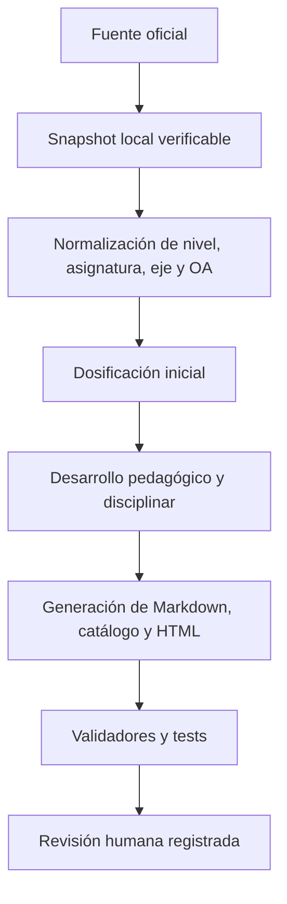

# Metodología

El proyecto separa tres problemas que suelen mezclarse: **qué pide el currículum**, **cómo se dosifica** y **cuánto desarrollo editorial tiene cada clase**.

[Volver al centro de documentación](docs/README.md) · [Consultar el estándar de calidad](QUALITY_STANDARD.md)

## Flujo de construcción

## 1. Fuente curricular

El snapshot de Currículum Nacional conserva nivel, asignatura, código y texto del OA, eje, URL de origen y fecha de verificación. Los enlaces de lectura se registran como recursos asociados; no se interpretan como obligatoriedad nacional.

La fuente estructurada es `sources/mineduc-curriculum-snapshot.json`. El catálogo público derivado es `curriculum/catalog.json`.

## 2. Dosificación

Cada OA comienza con cuatro clases y puede aumentar hasta siete cuando:

- contiene varias acciones o un texto extenso;
- exige investigar, crear, producir, diseñar, evaluar, analizar, argumentar o interpretar;
- incorpora lecturas asociadas;
- requiere contraste, transferencia o integración antes de reunir evidencia final.

La progresión base combina diagnóstico, comprensión, práctica, autonomía y demostración. Es una heurística editorial, no una prescripción horaria.

## 3. Desarrollo de una clase

Una clase desarrollada debe especificar propósito docente, meta estudiantil, inicio, modelado, práctica guiada, desempeño individual, materiales, apoyo, profundización, ticket, evidencia, criterios observables, decisión posterior y adaptación a 45 minutos.

Para 1° básico, la redacción prioriza experiencias concretas, consignas claras, participación amplia y transición gradual hacia representaciones gráficas o simbólicas.

## 4. Estados editoriales

| Estado | Significado |
|---|---|
| Inventariada | Existe OA, nivel, asignatura, eje y fuente. |
| Secuenciada | Tiene posición, duración y fases propuestas. |
| Desarrollada | Cumple el contrato de contenido específico verificable. |
| Revisada | Registra control humano disciplinar, pedagógico, documental, accesible y de derechos. |
| Publicada | Cuenta con salida Markdown y HTML navegable. |

Estos estados no son equivalentes. En particular, una página publicada puede seguir pendiente de revisión humana.

## 5. Generación reproducible

`scripts/generate_school_program.py` produce:

- el catálogo JSON;
- las fichas Markdown por OA;
- las páginas HTML por OA;
- la vista de 1° básico;
- la documentación generada de 1° básico;
- la malla y el sitemap.

La CI vuelve a generar todo y falla si el repositorio contiene artefactos derivados desactualizados.

## 6. Validación y límites

Los validadores comprueban conteos, identificadores, campos, anclas, páginas, estados editoriales y licencias. Los tests no certifican exactitud disciplinar, pertinencia local ni accesibilidad real con estudiantes.

La revisión humana debe:

1. contrastar la clase con el OA y la disciplina;
2. revisar claridad, progresión y carga cognitiva;
3. comprobar acceso, seguridad y pertinencia cultural;
4. verificar fuentes, atribuciones y derechos;
5. registrar responsable, fecha y hallazgos.

## Qué no afirma el proyecto

- No representa al Ministerio de Educación.
- No reemplaza programas de estudio, planificación institucional ni adecuaciones pertinentes.
- No afirma que todos los estudiantes cursen simultáneamente todas las asignaturas u opciones listadas.
- No declara revisión humana donde no existe evidencia registrada.
- No convierte enlaces de lectura en listas obligatorias ni aloja obras protegidas.
