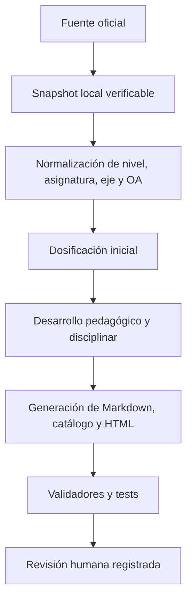

# Metodología

El proyecto separa tres problemas que suelen mezclarse: **qué pide el currículum**, **cómo se dosifica** y **cuánto desarrollo editorial tiene cada clase**.

[Volver al centro de documentación](docs/README.md) · [Consultar el estándar de calidad](QUALITY_STANDARD.md)

## Flujo de construcción

```mermaid
flowchart TD
    A[Fuente oficial] --> B[Snapshot local verificable]
    B --> C[Normalización de nivel, asignatura, eje y OA]
    C --> D[Dosificación inicial]
    D --> E[Desarrollo pedagógico y disciplinar]
    E --> F[Generación de Markdown, catálogo y HTML]
    F --> G[Validadores y tests]
    G --> H[Revisión humana registrada]
```

## 1. Fuente curricular

El snapshot de Currículum Nacional conserva nivel, asignatura, código y texto del OA, eje, URL de origen y fecha de verificación. Los enlaces de lectura se registran como recursos asociados; no se interpretan como obligatoriedad nacional.

La fuente estructurada es `sources/mineduc-curriculum-snapshot.json`. El catálogo público derivado es `curriculum/catalog.json`.

## 2. Dosificación

Cada OA comienza con cuatro clases y puede aumentar hasta siete cuando:

- contiene varias acciones o un texto extenso;
- exige investigar, crear, producir, diseñar, evaluar, analizar, argumentar o interpretar;
- incorpora lecturas asociadas;
- requiere contraste, transferencia o integración antes de reunir evidencia final.

La progresión base combina diagnóstico, comprensión, práctica, autonomía y demostración. Es una heurística editorial, no una prescripción horaria.

## 3. Desarrollo de una clase

Una clase desarrollada debe especificar propósito docente, meta estudiantil, inicio, modelado, práctica guiada, desempeño individual, materiales, apoyo, profundización, ticket, evidencia, criterios observables y decisión posterior. La capa de calidad agrega a cada clase un recurso concreto disciplinar, una consigna exacta, una referencia de respuesta, una pauta analítica de cuatro niveles, una lista de preparación y una distribución operativa de 45 minutos.

La diferenciación no se acredita insertando el código del OA en frases repetidas. Se acredita cuando cambian el insumo, la acción solicitada, la evidencia y el criterio disciplinar. Los validadores rechazan los marcadores genéricos conocidos y comprueban que el paquete completo aparezca una vez por clase en Markdown y HTML.

Para 1° básico, la redacción prioriza experiencias concretas, consignas claras, participación amplia y transición gradual hacia representaciones gráficas o simbólicas.

## 4. Estados editoriales

| Estado | Significado |
|---|---|
| Inventariada | Existe OA, nivel, asignatura, eje y fuente. |
| Secuenciada | Tiene posición, duración y fases propuestas. |
| Desarrollada | Cumple el contrato de contenido específico verificable. |
| Integrada | Una habilidad o actitud se planifica dentro de las clases de contenido y no se contabiliza como clase independiente. |
| Revisada | Registra control humano disciplinar, pedagógico, documental, accesible y de derechos. |
| Publicada | Cuenta con salida Markdown y HTML navegable. |

Estos estados no son equivalentes. En particular, una página publicada puede seguir pendiente de revisión humana. En 1° básico, 153 OA de contenido producen 691 clases y 84 OA transversales se documentan como 343 experiencias integradas. En 2° básico, 161 OA de contenido producen 721 clases y 86 OA transversales se materializan en 351 experiencias. En 3° básico, 165 OA de contenido producen 757 clases y 92 OA transversales se materializan en 379 experiencias. En 4° básico, 175 OA de contenido producen 811 clases y 93 OA transversales se materializan en 384 experiencias. En 5° básico, 193 OA de contenido producen 920 clases y 102 OA transversales se materializan en 420 experiencias. En 6° básico, 209 OA de contenido producen 952 clases y 92 OA transversales se materializan en 422 experiencias. En 7° básico, 153 objetivos de contenido producen 760 clases y 122 objetivos transversales se materializan en 515 experiencias. En 8° básico, 152 objetivos de contenido producen 771 clases y 101 objetivos transversales se materializan en 430 experiencias. En 1° medio, 147 OA de contenido producen 753 clases y 106 OA transversales se materializan en 456 experiencias. En Matemática y Lengua y Literatura de 2° medio, 36 OA de contenido producen 201 clases y 29 OA transversales se materializan en 122 experiencias. Los nueve niveles desde 1° básico hasta 1° medio tienen desarrollo interno completo; 2° medio continúa en desarrollo.

En 4° básico, cada asignatura conserva un protocolo disciplinar propio: representación y comprobación matemática; lectura, escritura y oralidad con evidencia; indagación científica; análisis de fuentes históricas; creación artística y musical; desempeño motriz seguro; casos protegidos en Orientación; diseño tecnológico; comunicación en inglés y pertinencia comunitaria en lengua y cultura originaria.

## 5. Generación reproducible

`scripts/generate_school_program.py` produce:

- el catálogo JSON;
- las fichas Markdown por OA;
- las páginas HTML por OA;
- las vistas completas y guías de asignatura de 1° a 8° básico;
- la documentación generada de los nueve niveles completos desde 1° básico hasta 1° medio y dos asignaturas de 2° medio, con 105 guías de asignatura;
- la malla y el sitemap.

La CI vuelve a generar todo y falla si el repositorio contiene artefactos derivados desactualizados.

## 6. Validación y límites

Los validadores comprueban conteos, identificadores, campos, anclas, páginas, estados editoriales y licencias. Los tests no certifican exactitud disciplinar, pertinencia local ni accesibilidad real con estudiantes.

La revisión humana debe:

1. contrastar la clase con el OA y la disciplina;
2. revisar claridad, progresión y carga cognitiva;
3. comprobar acceso, seguridad y pertinencia cultural;
4. verificar fuentes, atribuciones y derechos;
5. registrar responsable, fecha y hallazgos.

## Qué no afirma el proyecto

- No representa al Ministerio de Educación.
- No reemplaza programas de estudio, planificación institucional ni adecuaciones pertinentes.
- No afirma que todos los estudiantes cursen simultáneamente todas las asignaturas u opciones listadas.
- No declara revisión humana donde no existe evidencia registrada.
- No convierte enlaces de lectura en listas obligatorias ni aloja obras protegidas.
