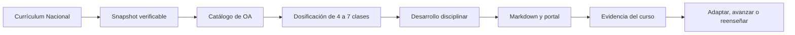

# 🇨🇱 Trayectoria Escolar Chile

## 12.997 clases · 2.823 OA · 12 niveles · de 1° básico a 4° medio

Repositorio educativo abierto para convertir el Currículum Nacional de Chile en rutas de enseñanza navegables, trazables y adaptables.

> **Estado actual:** las 12.997 clases están inventariadas, secuenciadas y publicadas. **1° básico está completamente desarrollado: 1.034 clases, 237 OA y 11 asignaturas.** Hay 1.056 clases desarrolladas en total al sumar 22 pilotos de otros niveles. La revisión humana se informa por separado: hoy existen **0 clases declaradas como revisadas**.

[Abrir el portal](https://vladimiracunadev-create.github.io/chilean-school-learning-path/) · [Recorrer 1° básico](https://vladimiracunadev-create.github.io/chilean-school-learning-path/levels/1-basico.html) · [Ver la malla](CURRICULUM.md) · [Centro de documentación](docs/README.md) · [Estado editorial](EDITORIAL_STATUS.md)

## Qué es este proyecto

No es solo una lista de Objetivos de Aprendizaje. Cada OA se transforma en una secuencia de 4 a 7 **clases**, con identificadores estables y una fuente oficial enlazada.

Una clase desarrollada incluye:

| Momento | Qué aporta |
|---|---|
| Propósito y meta | Distingue la intención docente de lo que comprenderá el estudiante. |
| Inicio | Recupera conocimientos previos y hace visible una primera respuesta. |
| Modelado | Explica el contenido con un ejemplo, decisiones visibles y un error previsible. |
| Práctica guiada | Permite ensayar con apoyo y retroalimentación inmediata. |
| Desempeño individual | Produce evidencia de cada estudiante, no solo del grupo. |
| Apoyo y profundización | Cambia el acceso sin rebajar el OA y amplía el desafío sin repetir mecánicamente. |
| Cierre y decisión | Usa criterios observables para avanzar, reagrupar o reenseñar. |

## Cómo recorrerlo

1. Elige un nivel y una asignatura en el [portal](https://vladimiracunadev-create.github.io/chilean-school-learning-path/).
2. Busca por tema, eje, código OA o palabra, con o sin tildes.
3. Abre un OA para revisar su secuencia completa y la fuente curricular.
4. Adapta materiales, apoyos y duración a la realidad del curso.
5. Usa el ticket de salida y los criterios observables para decidir el paso siguiente.

Para comenzar con un nivel terminado, consulta el [mapa pedagógico de 1° básico](docs/PRIMERO_BASICO.md).

## Cobertura por nivel

| Nivel | OA | Clases | Asignaturas | Desarrollo editorial |
|---|---:|---:|---:|---|
| 1° básico | 237 | 1.034 | 11 | Completo |
| 2° básico | 247 | 1.072 | 11 | Secuenciado |
| 3° básico | 257 | 1.136 | 11 | 11 clases piloto |
| 4° básico | 268 | 1.195 | 11 | 4 clases piloto |
| 5° básico | 295 | 1.340 | 12 | Secuenciado |
| 6° básico | 301 | 1.374 | 12 | Secuenciado |
| 7° básico | 275 | 1.275 | 12 | Secuenciado |
| 8° básico | 253 | 1.201 | 12 | 7 clases piloto |
| 1° medio | 253 | 1.209 | 11 | Secuenciado |
| 2° medio | 248 | 1.200 | 11 | Secuenciado |
| 3° medio FG | 98 | 495 | 18 | Secuenciado |
| 4° medio FG | 91 | 466 | 17 | Secuenciado |
| **Total** | **2.823** | **12.997** | — | **1.056 desarrolladas** |

“Secuenciado” no significa “desarrollado” ni “revisado”. Consulta el [estándar de calidad](QUALITY_STANDARD.md) para conocer cada estado.

## De la fuente a la sala de clases



La heurística propone una dosificación inicial; no reemplaza el diagnóstico, la planificación institucional ni el juicio profesional docente.

## Documentación

| Necesidad | Documento |
|---|---|
| Entender el sistema completo | [Centro de documentación](docs/README.md) |
| Planificar y conducir una clase | [Guía pedagógica](TEACHING_GUIDE.md) |
| Recorrer el nivel terminado | [1° básico: mapa de contenidos](docs/PRIMERO_BASICO.md) |
| Evaluar y decidir el paso siguiente | [Evaluación formativa](docs/EVALUACION_FORMATIVA.md) |
| Comprender generación, dosificación y límites | [Metodología](METHODOLOGY.md) |
| Elegir una ruta según el rol | [Rutas de uso](LEARNING_PATHS.md) |
| Ver avance por nivel | [Roadmap](ROADMAP.md) |
| Contribuir sin romper la trazabilidad | [Guía de contribución](CONTRIBUTING.md) |
| Consultar fuentes y lecturas | [Fuentes oficiales](OFFICIAL_REFERENCES.md) · [Textos y lecturas](BOOKS_AND_READINGS.md) |

## Desarrollo y verificación

Requiere Python 3.12. El portal es estático: no usa dependencias JavaScript ni servicios externos.

```bash
python scripts/generate_school_program.py
python scripts/validate_school_program.py
python scripts/validate_licensing.py
python -m unittest discover -s tests -p "test_*.py" -v
```

El workflow regenera todos los artefactos, bloquea cualquier diferencia, ejecuta validadores y tests, y solo después publica GitHub Pages.

## Fuentes, alcance y licencias

Snapshot verificado el **2026-09-24** desde [Currículum Nacional](https://www.curriculumnacional.cl/curriculum/cursos-y-niveles). El catálogo registra **595 enlaces de lectura** asociados por MINEDUC. Las lecturas se enlazan; no se reproducen obras protegidas ni se inventa obligatoriedad.

El software se distribuye bajo MIT y el contenido educativo original bajo CC BY-NC-SA 4.0. Consulta [LICENSING.md](LICENSING.md) para el detalle.

Proyecto independiente, sin representación del Ministerio de Educación de Chile.
