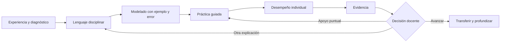
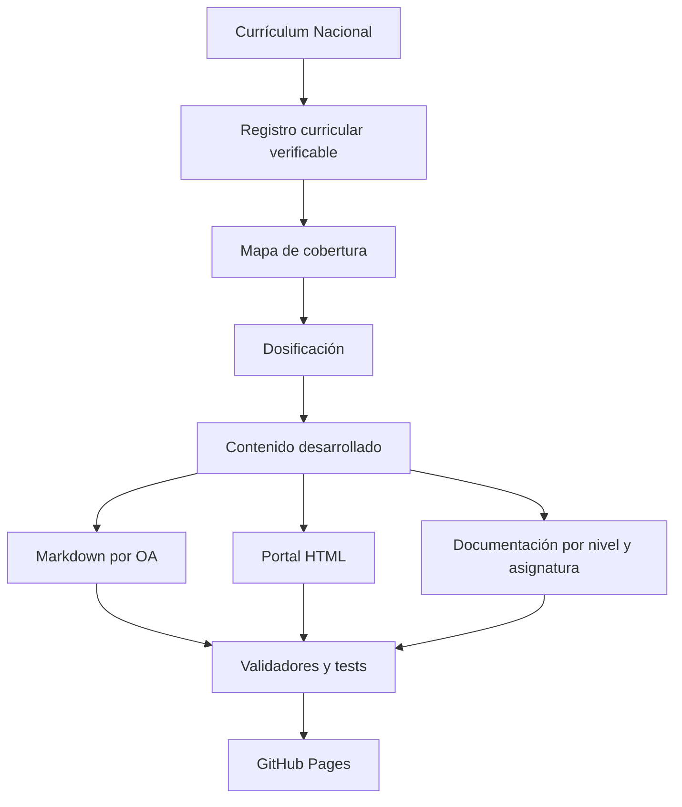

<div align="center">

# 🇨🇱 Trayectoria Escolar Chile

## **12.997 clases · 2.823 OA · 12 niveles · de 1° básico a 4° medio**

**Un currículo abierto y navegable que convierte los Objetivos de Aprendizaje de Chile en secuencias claras, adaptables y trazables.**

[](https://github.com/vladimiracunadev-create/chilean-school-learning-path/actions/workflows/pages.yml)

[](CURRICULUM.md)
[](CURRICULUM.md)
[](docs/1-basico/README.md)
[](EDITORIAL_STATUS.md)

[](README.md)
[](.github/workflows/pages.yml)
[](CURRICULUM.md)

[](LICENSE)
[](LICENSE-CONTENT.md)


[🗂️ Índice completo](CURRICULUM.md) · [🧒 1° básico](docs/1-basico/README.md) · [📚 Centro documental](docs/README.md) · [📖 Glosario](docs/GLOSARIO.md) · [🧭 Rutas de uso](LEARNING_PATHS.md) · [📘 Syllabus](docs/SYLLABUS.md) · [🗺️ Roadmap](ROADMAP.md) · [🤝 Contribuir](CONTRIBUTING.md)

</div>

---

> **Transparencia editorial.** Las 12.997 clases están inventariadas, secuenciadas y publicadas. Hay **1.056 desarrolladas**: las 1.034 de 1° básico y 22 pilotos de otros niveles. Existen **0 clases declaradas como revisadas** porque todavía no se ha registrado revisión humana completa. Publicar no equivale a revisar.

> ⚠️ **Uso responsable.** Este es un proyecto educativo independiente. No sustituye las Bases Curriculares, los Programas de Estudio, la planificación del establecimiento, las adecuaciones pertinentes ni el juicio profesional. Nunca se deben publicar aquí datos identificables de estudiantes.

## 🧭 OA, en palabras simples

**OA significa Objetivo de Aprendizaje:** indica qué debe llegar a comprender o hacer el estudiante. No es una clase ni una actividad. Por eso un OA se transforma aquí en una secuencia de 4 a 7 clases con práctica, tareas, actividades complementarias y evidencia.

`MA01 OA 01` significa Matemática · 1° básico · Objetivo de Aprendizaje 1. La [guía “¿Qué es un OA?”](docs/QUE_ES_UN_OA.md) explica cada parte con un ejemplo completo.

## 🎯 Qué es este proyecto

Trayectoria Escolar Chile transforma el currículo oficial en un sistema práctico para docentes, equipos pedagógicos, familias y revisores. Cada OA conserva su fuente y se despliega en 4 a 7 clases identificadas de manera estable.

No entrega una frase genérica por clase. Una clase desarrollada contiene:

- propósito docente y meta en lenguaje estudiantil;
- conocimientos previos, vocabulario y error previsible;
- inicio, modelado, práctica guiada y desempeño individual;
- materiales y alternativa viable sin conectividad;
- apoyo que conserva el OA y profundización no mecánica;
- ticket, evidencia, criterios observables y decisión posterior;
- adaptación de 90 a 45 minutos;
- tarea breve, flexible y sin dependencia de internet o compras;
- actividades complementarias de recuperación y profundización;
- control de dificultades con acción inmediata y comprobación;
- coordinación de roles profesionales dentro del aula;
- fuente curricular y estado editorial.

## 🧩 Qué problemas busca resolver

- Un OA oficial indica qué aprender, pero no siempre cómo convertirlo en una secuencia.
- Una actividad puede ser entretenida sin producir evidencia del aprendizaje.
- Las planificaciones extensas suelen ocultar qué observar y qué hacer después.
- Apoyar puede terminar reduciendo el OA; profundizar puede degenerar en más repetición.
- Un repositorio puede parecer completo solo porque tiene muchos archivos.
- La documentación puede quedar desincronizada de los datos y del portal.

El proyecto responde con trazabilidad, estructura estable, contenido disciplinar, validación automática y estados editoriales explícitos.

## 📖 De dónde sale el contenido

El punto de partida no es una colección informal de temas: es el [Currículum Nacional de Chile](https://www.curriculumnacional.cl/curriculum/cursos-y-niveles). El repositorio registra los niveles, asignaturas, ejes y OA junto con la URL oficial de cada objetivo y la fecha en que fue comprobado.

| Para comprender | Documento legible | Qué responde |
|---|---|---|
| Procedencia curricular | [Fuentes oficiales](OFFICIAL_REFERENCES.md) | de dónde provienen los OA, programas, lecturas y referencias legales |
| Cobertura del proyecto | [Cobertura completa](docs/COBERTURA.md) | cuántos niveles, OA y clases existen y cuál es su estado editorial |
| Desarrollo pedagógico | [Programa completo de 1° básico](docs/1-basico/README.md) | cómo se organizan las 1.034 clases, qué se enseña y qué evidencia se observa |
| Método de construcción | [Metodología](METHODOLOGY.md) | cómo se pasa del OA a una secuencia y cómo se comprueba su consistencia |
| Derechos y reutilización | [Guía de licencias](docs/LICENCIAS.md) | qué puede reutilizarse, con qué atribución y bajo qué condiciones |

El registro curricular fue comprobado el **2026-09-24**. Conserva **595 enlaces de lectura** asociados desde fichas oficiales. Esos enlaces no convierten las obras en contenido propio ni en lecturas obligatorias; el repositorio no reproduce sus textos.

## 🌐 Portal, navegación y formatos

El sitio HTML de GitHub Pages convierte el catálogo en una experiencia navegable. La documentación Markdown mantiene, por separado, enlaces únicamente hacia otros archivos del repositorio:

- búsqueda por palabra, OA o código de clase;
- filtros por nivel, asignatura y tipo de cobertura;
- enlace directo a cada clase mediante una ancla estable;
- navegación entre objetivos anterior y siguiente;
- vista dedicada de 1° básico y centro documental visual;
- tema claro/oscuro y diseño adaptable;
- funcionamiento sin cuentas, telemetría ni envío de datos del usuario.

| Salida | Cantidad | Para qué sirve |
|---|---:|---|
| Markdown por OA | 2.823 | edición, revisión, historial y reutilización |
| HTML por OA | 2.823 | lectura visual y navegación web |
| Anclas de clase en ambos formatos | 12.997 | enlaces estables a cada propuesta |
| Explorador del sitio | 12.997 clases | búsqueda y filtros sin exponer archivos técnicos |
| Documentación de 1° básico | 11 guías de asignatura | comprender progresión, método y evidencia |

No existe todavía una aplicación móvil ni un manual PDF oficial de este proyecto. Para trabajar sin conexión se puede descargar o clonar el repositorio: las fichas Markdown son legibles directamente y el sitio estático usa sus propios HTML, CSS, JavaScript y datos, sin depender de una cuenta.

### 📥 Accesos directos y descargas

- [Índice completo del currículo](CURRICULUM.md) — los 2.823 OA organizados por nivel y asignatura.
- [Descargar el repositorio como ZIP](https://github.com/vladimiracunadev-create/chilean-school-learning-path/archive/refs/heads/main.zip) — contenido y sitio para consulta local.
- [Cómo se corresponden Markdown y HTML](docs/FORMATOS.md) — rutas, anclas y controles.

## 📍 Estado actual

| Estado | Clases | Qué significa |
|---|---:|---|
| Inventariada | 12.997 | OA, nivel, asignatura, eje y fuente identificados |
| Secuenciada | 12.997 | posición, fase y duración inicial propuestas |
| Desarrollada | 1.056 | contrato pedagógico y disciplinar completo |
| Revisada | 0 | control humano documentado |
| Publicada | 12.997 | Markdown y HTML navegables |

Consulta el [estado editorial completo](EDITORIAL_STATUS.md) y el [estándar de calidad](QUALITY_STANDARD.md).

## 🧒 1° básico · nivel desarrollado

1° básico es el primer nivel trabajado de principio a fin: **237 OA, 1.034 clases y 11 asignaturas**.

| Asignatura | OA | Clases | Guía narrativa |
|---|---:|---:|---|
| Artes Visuales | 12 | 52 | [Leer](docs/1-basico/artes-visuales.md) |
| Ciencias Naturales | 22 | 89 | [Leer](docs/1-basico/ciencias-naturales.md) |
| Educación Física y Salud | 19 | 80 | [Leer](docs/1-basico/educacion-fisica-salud.md) |
| Historia, Geografía y Ciencias Sociales | 31 | 132 | [Leer](docs/1-basico/historia-geografia-ciencias-sociales.md) |
| Inglés (Propuesta) | 18 | 85 | [Leer](docs/1-basico/ingles-propuesta.md) |
| Lengua y Cultura de los Pueblos Originarios Ancestrales | 33 | 147 | [Leer](docs/1-basico/lengua-cultura-pueblos-originarios-ancestrales.md) |
| Lenguaje y Comunicación | 33 | 160 | [Leer](docs/1-basico/lenguaje-comunicacion.md) |
| Matemática | 36 | 151 | [Leer](docs/1-basico/matematica.md) |
| Música | 14 | 57 | [Leer](docs/1-basico/musica.md) |
| Orientación | 8 | 35 | [Leer](docs/1-basico/orientacion.md) |
| Tecnología | 11 | 46 | [Leer](docs/1-basico/tecnologia.md) |

➡️ **[Abrir el programa completo de 1° básico](docs/1-basico/README.md)**

Cada guía de asignatura explica de qué trata, qué problemas pedagógicos resuelve, resultados, prerrequisitos, método disciplinar, estructura por ejes, recorrido OA por OA, evidencia, barreras frecuentes, acceso y profundización.

## 🧠 Cómo progresa una secuencia



El orden hace visible el aprendizaje. No obliga a avanzar por calendario: la evidencia real puede justificar mantener, acortar o ampliar una secuencia.

## 🧱 Anatomía de una clase desarrollada

| Sección | Pregunta que responde | Resultado |
|---|---|---|
| Propósito docente | ¿Qué debe conseguir la enseñanza? | intención profesional clara |
| Meta estudiantil | ¿Qué comprenderé o podré hacer? | lenguaje accesible |
| Inicio | ¿Qué saben y qué barrera aparece? | diagnóstico breve |
| Modelado | ¿Qué decisión experta debo hacer visible? | ejemplo y contraejemplo |
| Práctica guiada | ¿Cómo ensayamos con apoyo? | retroalimentación inmediata |
| Desempeño individual | ¿Qué puede hacer cada estudiante? | evidencia atribuible |
| Apoyo | ¿Cómo cambio el acceso sin bajar el OA? | andamiaje gradual |
| Profundización | ¿Cómo amplío sin mecanizar? | comparación o transferencia |
| Ticket | ¿Qué observo al cerrar? | respuesta breve |
| Criterios | ¿Qué cuenta como logro? | señales observables |
| Decisión posterior | ¿Qué hago mañana? | avanzar, reagrupar o reenseñar |
| Tarea flexible | ¿Cómo consolida sin sobrecarga? | experiencia breve y accesible |
| Actividades complementarias | ¿Qué opción uso según la evidencia? | recuperación, práctica o profundidad |
| Dificultades y acciones | ¿Qué hago si aparece una barrera? | acción inmediata y comprobación |
| Roles profesionales | ¿Quién conduce y quién aporta? | coordinación explícita sin delegar el OA |

## 🧰 Caja de herramientas pedagógicas

El valor práctico no está solo en contar clases. El repositorio conecta cada planificación con recursos para tomar decisiones reales:

- 📖 **[Glosario educativo](docs/GLOSARIO.md):** OA, eje, cobertura, evidencia, criterio, apoyo, profundización y siglas frecuentes.
- 🧩 **[Actividades y tareas](TEACHING_GUIDE.md#tareas-y-actividades-complementarias):** cada clase desarrollada de 1° básico incluye una tarea flexible y tres actividades complementarias diferenciadas.
- ⚠️ **[Dificultades con acciones](docs/DIFICULTADES_EN_EL_AULA.md):** señal observable → acción inmediata → comprobación → decisión.
- 👥 **[Roles profesionales](docs/ROLES_DOCENTES.md):** responsabilidades del docente, especialistas, educación diferencial, asistentes, CRA, convivencia y otros apoyos.
- 📊 **[Rúbrica transversal](docs/RUBRICA_EVALUACION.md):** cuatro lecturas de evidencia y la acción pedagógica asociada.
- 🏠 **[Guía para familias](docs/GUIA_FAMILIAS.md):** acompañar el aprendizaje sin reemplazar al estudiante ni convertir el hogar en otra jornada escolar.
- ♿ **[Evaluación formativa](docs/EVALUACION_FORMATIVA.md):** cambiar acceso, reagrupar y volver a comprobar sin reducir el OA.
- 🔎 **[Revisión humana](docs/REVISION_HUMANA.md):** cómo una persona competente registra una revisión real.

## 🧭 Rutas según quién usa el repositorio

No todas las personas deben leerlo en el mismo orden. Las [rutas de uso completas](LEARNING_PATHS.md) organizan el recorrido por tarea:

| Persona o equipo | Empieza aquí | Resultado esperado |
|---|---|---|
| Docente de 1° básico | [Programa del nivel](docs/1-basico/README.md) | preparar una clase contextualizada y recoger evidencia útil |
| Docente especialista | [Guías por asignatura](docs/1-basico/README.md#-las-11-asignaturas) | comprender progresión disciplinar, errores y criterios |
| Educación diferencial o equipo de apoyo | [Roles](docs/ROLES_DOCENTES.md) y [dificultades](docs/DIFICULTADES_EN_EL_AULA.md) | acordar barrera, acción, vía de acceso y comprobación |
| Coordinación pedagógica o UTP | [Cobertura](docs/COBERTURA.md) y [estado editorial](EDITORIAL_STATUS.md) | revisar cobertura y calidad sin confundir publicación con revisión |
| Familia o persona cuidadora | [Guía para familias](docs/GUIA_FAMILIAS.md) | entender el propósito y acompañar sin hacer la tarea |
| Revisor o colaborador | [Metodología](METHODOLOGY.md) y [contribución](CONTRIBUTING.md) | proponer una mejora trazable que no rompa el catálogo |
| Mantenedor | [Estándar de calidad](QUALITY_STANDARD.md) | regenerar, validar y publicar sin deriva |

## 👩‍🏫 Para docentes y equipos pedagógicos

- 📅 **[Syllabus](docs/SYLLABUS.md):** alcance, resultados, ritmo y planificación anual de 1° básico.
- 🗂️ **[Programa completo de 1° básico](docs/1-basico/README.md):** 237 OA, 1.034 clases y 11 asignaturas.
- 🧭 **[Guía pedagógica](TEACHING_GUIDE.md):** qué hacer antes, durante y después de una clase.
- 📊 **[Rúbrica de evaluación](docs/RUBRICA_EVALUACION.md):** criterios observables y decisiones posteriores.
- ❓ **[Preguntas frecuentes](docs/FAQ.md):** tiempos, cobertura, adaptación, fuentes y límites.
- 🧪 **[Protocolo de revisión humana](docs/REVISION_HUMANA.md):** muestreo, severidad, registro y evidencia.

## 🧭 Cómo usarlo en seis pasos

1. Elige nivel, asignatura y OA en el [índice Markdown](CURRICULUM.md).
2. Lee la guía de asignatura para entender la progresión.
3. Revisa todas las clases del OA antes de preparar una.
4. Define evidencia y criterios antes de elegir materiales.
5. Adapta acceso, contexto y duración a tu curso.
6. Enseña, recoge evidencia y decide el paso siguiente.

El [syllabus](docs/SYLLABUS.md) desarrolla el proceso completo y la [guía docente](TEACHING_GUIDE.md) acompaña la conducción de aula.

## 📊 Evaluación que conduce a una decisión

La [rúbrica transversal](docs/RUBRICA_EVALUACION.md) usa cuatro niveles descriptivos:

| Nivel | Lectura | Próxima acción |
|---|---|---|
| Logrado con autonomía | aplica y explica sin copiar | avanzar o transferir |
| En desarrollo | necesita apoyo puntual | practicar y retirar ayuda |
| Requiere otra vía de acceso | la barrera impide observar | cambiar representación o respuesta |
| Sin evidencia suficiente | no es posible concluir | ofrecer otra oportunidad |

No son notas automáticas. Sirven para organizar la intervención y volver a comprobar.

## ♿ Acceso sin reducción

Mantener el OA no significa pedir a todos lo mismo del mismo modo. Se puede:

- anticipar vocabulario;
- demostrar y fragmentar consignas;
- usar objetos, imágenes, gestos o tecnología de apoyo;
- permitir ensayo oral antes de escribir;
- variar agrupamientos y tiempos;
- aceptar vías de respuesta pertinentes al OA;
- retirar los apoyos gradualmente.

Cuando ya existe dominio, se profundiza comparando, justificando, creando, mejorando o transfiriendo.

## 🏠 Familias y comunidad

La [guía para familias](docs/GUIA_FAMILIAS.md) explica cómo leer una ficha, conversar sobre lo aprendido y acompañar sin convertir el hogar en una segunda jornada escolar.

En lengua y cultura de pueblos originarios, la propuesta debe ajustarse al territorio y al contexto lingüístico, evitando generalizaciones y promoviendo validación comunitaria.

## 📚 Documentación de principio a fin

| Documento | Contenido |
|---|---|
| [Centro documental](docs/README.md) | mapa completo y rutas |
| [Syllabus](docs/SYLLABUS.md) | público, resultados, estructura, ritmo y planificación |
| [¿Qué es un OA?](docs/QUE_ES_UN_OA.md) | explicación simple de códigos, clases, actividades y evidencia |
| [Glosario educativo](docs/GLOSARIO.md) | términos, siglas, estados y códigos del proyecto |
| [Programa de 1° básico](docs/1-basico/README.md) | narrativa, asignaturas y progresión |
| [11 guías de asignatura](docs/1-basico/README.md) | recorrido OA por OA |
| [Guía pedagógica](TEACHING_GUIDE.md) | preparación, conducción y adaptación |
| [Roles profesionales](docs/ROLES_DOCENTES.md) | responsabilidades, colaboración y límites |
| [Dificultades en el aula](docs/DIFICULTADES_EN_EL_AULA.md) | señales, acciones y comprobación |
| [Rúbrica](docs/RUBRICA_EVALUACION.md) | evidencia y decisiones |
| [Cobertura navegable](docs/COBERTURA.md) | 12 niveles con acceso directo |
| [Formatos](docs/FORMATOS.md) | 12.997 clases en Markdown y HTML |
| [Licencias](docs/LICENCIAS.md) | reutilización de código, contenido, datos y activos |
| [FAQ](docs/FAQ.md) | dudas, límites y uso |
| [Guía para familias](docs/GUIA_FAMILIAS.md) | acompañamiento |
| [Revisión humana](docs/REVISION_HUMANA.md) | protocolo, listas y registro |
| [Metodología](METHODOLOGY.md) | fuente, generación y validación |
| [Roadmap](ROADMAP.md) | avance nivel por nivel |
| [Contribución](CONTRIBUTING.md) | contrato editorial y flujo |

## 🗺️ Cobertura total

| Nivel | OA | Clases | Estado de desarrollo |
|---|---:|---:|---|
| 1° básico | 237 | 1.034 | completo |
| 2° básico | 247 | 1.072 | secuenciado |
| 3° básico | 257 | 1.136 | 11 clases piloto |
| 4° básico | 268 | 1.195 | 4 clases piloto |
| 5° básico | 295 | 1.340 | secuenciado |
| 6° básico | 301 | 1.374 | secuenciado |
| 7° básico | 275 | 1.275 | secuenciado |
| 8° básico | 253 | 1.201 | 7 clases piloto |
| 1° medio | 253 | 1.209 | secuenciado |
| 2° medio | 248 | 1.200 | secuenciado |
| 3° medio · Formación General | 98 | 495 | secuenciado |
| 4° medio · Formación General | 91 | 466 | secuenciado |
| **Total** | **2.823** | **12.997** | **1.056 desarrolladas** |

## 🔎 Fuente, generación y controles



Requiere Python 3.12:

```bash
python scripts/generate_school_program.py
python scripts/validate_school_program.py
python scripts/validate_licensing.py
python -m unittest discover -s tests -p "test_*.py" -v
```

El workflow regenera todo, exige diff vacío, compila scripts, ejecuta validadores y tests y solo entonces despliega Pages.

## ✅ Calidad y CI

El repositorio no publica a ciegas. Cada `push` a `main` y cada pull request pasan por el workflow **Quality and Pages**.

| Etapa | Qué comprueba |
|---|---|
| Generación | reconstruye catálogo, 2.823 Markdown, 2.823 HTML, documentación y sitemap desde las fuentes |
| Programa | conteos, campos, identificadores, 12.997 anclas Markdown/HTML, navegación y artefactos requeridos |
| Licencias | presencia y coherencia de MIT, CC BY-NC-SA, datos, activos, terceros y política de fuentes |
| Tests | verdad del catálogo, 1° básico completo, unicidad de códigos, páginas públicas y registro seguro |
| Compilación | sintaxis de scripts y tests con Python 3.12 |
| Reproducibilidad | `git diff --exit-code` después de regenerar; bloquea artefactos desactualizados |
| Despliegue | empaqueta `site/` y publica GitHub Pages solo si toda la verificación anterior pasa |

| ⚙️ Workflow | Jobs | Estado visible |
|---|---|---|
| [`.github/workflows/pages.yml`](.github/workflows/pages.yml) | `Generate and verify` → `Deploy GitHub Pages` | [badge y ejecuciones](https://github.com/vladimiracunadev-create/chilean-school-learning-path/actions/workflows/pages.yml) |

Los mismos controles se ejecutan localmente:

```bash
python scripts/generate_school_program.py
python scripts/validate_school_program.py
python scripts/validate_licensing.py
python -m unittest discover -s tests -p "test_*.py" -v
python -m compileall -q scripts tests
git diff --exit-code
```

## 🎯 Qué es y qué no es este programa

<table>
<tr>
<td valign="top" width="50%">

### ✅ Lo que sí es

- 📚 un mapa trazable de **12.997 clases** asociado a **2.823 OA** y 12 niveles;
- 🧒 un programa de **1° básico desarrollado** con 1.034 clases, tareas, actividades y respuesta a dificultades;
- 🧭 un portal para buscar, filtrar y abrir cada clase en HTML;
- ✍️ contenido editable y revisable en Markdown, con identificadores estables;
- 👩‍🏫 una caja de herramientas para docentes, equipos de apoyo, UTP, familias y revisores;
- 🔎 un proyecto transparente sobre fuente, estado editorial, revisión humana y licencias.

</td>
<td valign="top" width="50%">

### ❌ Lo que no es

- 🚫 una plataforma oficial del Ministerio de Educación ni una nueva base curricular;
- 🚫 un horario que obligue a impartir las 12.997 clases o toda la oferta simultáneamente;
- 🚫 un sustituto del conocimiento docente, del contexto territorial o de las adecuaciones pertinentes;
- 🚫 una afirmación de revisión experta: actualmente hay **0 revisiones humanas registradas**;
- 🚫 una aplicación móvil, un manual PDF ni un sistema de notas o seguimiento estudiantil;
- 🚫 autorización para reproducir textos, imágenes o recursos enlazados de terceros.

</td>
</tr>
</table>

## 💡 Idea fuerza

> El valor de este proyecto no está en presumir 12.997 registros, sino en **convertir el currículum en decisiones de aprendizaje comprensibles**: qué se espera, cómo enseñarlo, qué puede hacer el estudiante, qué dificultad apareció y cuál es el siguiente paso.

## 📖 Fuentes y derechos

El registro curricular fue verificado el **2026-09-24** desde [Currículum Nacional](https://www.curriculumnacional.cl/curriculum/cursos-y-niveles). El proyecto conserva **595 enlaces de lectura** asociados por MINEDUC. Se enlazan recursos; no se reproducen obras protegidas ni se inventa obligatoriedad.

El software original usa [MIT](LICENSE); las clases, tareas, actividades y guías originales usan [CC BY-NC-SA 4.0](LICENSE-CONTENT.md). Datos, activos y terceros tienen reglas propias en [DATA-LICENSE.md](DATA-LICENSE.md), [ASSET_LICENSES.md](ASSET_LICENSES.md) y [THIRD_PARTY_NOTICES.md](THIRD_PARTY_NOTICES.md). Consulta la [guía simple](docs/LICENCIAS.md) o la [política completa](LICENSING.md).

Proyecto independiente, sin representación del Ministerio de Educación de Chile.

---

<div align="center">

**Hecho para transformar el currículum en aprendizaje claro, humano y aplicable.**

[⬆️ Volver al inicio](#-trayectoria-escolar-chile)

<br>

**¿Te resulta útil? ⭐ Dale una estrella al repositorio.**

[](https://github.com/vladimiracunadev-create/chilean-school-learning-path/stargazers)
[](https://github.com/vladimiracunadev-create/chilean-school-learning-path/network/members)
[](https://github.com/vladimiracunadev-create)

Hecho con cuidado pedagógico por [Vladimir Acuña](https://github.com/vladimiracunadev-create)

</div>
