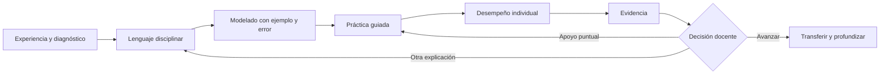
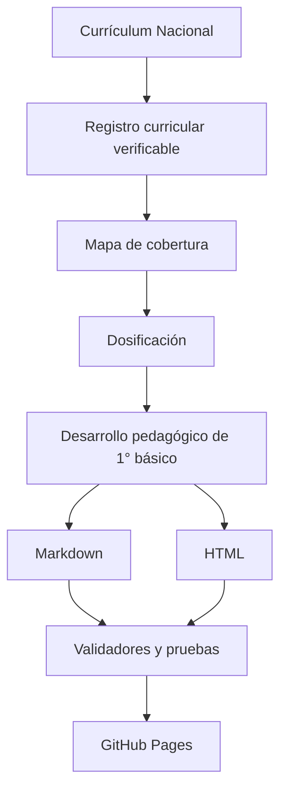

<div align="center">

# 🇨🇱 Trayectoria Escolar Chile

## **Matemática de 1° básico completa · 83 clases · 20 OA de contenido**

**Un proyecto abierto que transforma, OA por OA, el currículo chileno en clases claras, investigadas y pedagógicamente utilizables.**

[](https://github.com/vladimiracunadev-create/chilean-school-learning-path/actions/workflows/pages.yml)

[](docs/1-basico/README.md)
[](docs/PRIMERO_BASICO.md)
[](docs/1-basico/matematica.md)
[](docs/1-basico/README.md#-las-11-asignaturas)

[](docs/COBERTURA.md)
[](docs/FORMATOS.md)

[](LICENSE)
[](LICENSE-CONTENT.md)

[🧒 Empezar con 1° básico](docs/1-basico/README.md) · [🗂️ Buscar un OA](CURRICULUM.md) · [📚 Centro documental](docs/README.md) · [🧭 Guía docente](TEACHING_GUIDE.md) · [📖 Glosario](docs/GLOSARIO.md) · [🤝 Contribuir](CONTRIBUTING.md)

[📋 Plan maestro por nivel, asignatura e ítem](docs/PLAN_DESARROLLO.md)

</div>

---

> [!IMPORTANT]
> **Estado real del proyecto:** Matemática de 1° básico tiene sus **83 clases de contenido desarrolladas en 20 OA**. Sus 16 OA de habilidades y actitudes se incorporan mediante 68 experiencias transversales y no se cuentan como clases independientes. En todo 1° básico hay 93 clases desarrolladas, 68 experiencias integradas y 873 borradores. Existen además 22 clases piloto en otros niveles. La verificación interna está completa; la revisión humana especializada sigue pendiente.

> [!CAUTION]
> Proyecto educativo independiente. No representa al Ministerio de Educación de Chile ni reemplaza las Bases Curriculares, los Programas de Estudio, la planificación del establecimiento, las adecuaciones pertinentes o el juicio profesional. No publiques datos identificables de estudiantes.

## 👋 Empieza aquí

Este repositorio sirve hoy para tres cosas distintas, expresadas sin mezclar sus estados:

- **Usar Matemática de 1° básico:** ofrece 83 clases específicas, organizadas en 20 secuencias de contenido, todavía pendientes de revisión humana.
- **Consultar el currículo:** organiza 2.823 OA oficiales desde 1° básico hasta 4° medio.
- **Construir los niveles siguientes:** conserva 12.997 espacios de clase secuenciados como plan de expansión, no como clases terminadas.

Si vienes a preparar clases, abre el **[mapa de 1° básico](docs/1-basico/README.md)** y comprueba el estado de cada ficha antes de usarla. Si necesitas saber qué está terminado y qué falta, consulta la **[cobertura editorial](docs/COBERTURA.md)**. Si buscas un código curricular específico, usa el **[índice de OA](CURRICULUM.md)**.

## 🧭 OA, en palabras simples

**OA significa Objetivo de Aprendizaje:** expresa qué debe llegar a comprender o hacer el estudiante. No es una clase, una actividad ni una página del repositorio.

Por ejemplo, `MA01 OA 01` significa Matemática · 1° básico · Objetivo de Aprendizaje 1. Cuando una secuencia alcanza el estado **desarrollada**, despliega el OA en clases con modelado, práctica, tareas, actividades complementarias y evidencia. Las fichas marcadas como **borrador** todavía no cumplen esa promesa. La guía **[¿Qué es un OA?](docs/QUE_ES_UN_OA.md)** explica el código.

## 🎯 Qué es este proyecto

Trayectoria Escolar Chile convierte el currículo oficial en decisiones concretas de enseñanza. Cada clase que el proyecto marca como desarrollada incluye:

- propósito docente y meta comprensible para estudiantes;
- conocimientos previos, vocabulario y errores previsibles;
- inicio, modelado, práctica guiada y desempeño individual;
- materiales y alternativa viable sin conectividad;
- apoyo que mantiene el OA y profundización que evita la repetición mecánica;
- ticket de salida, evidencia, criterios observables y decisión posterior;
- adaptación de 90 a 45 minutos;
- tarea breve, flexible y sin compras obligatorias;
- actividades complementarias para recuperar, practicar o profundizar;
- dificultades del aula con acción inmediata y comprobación;
- coordinación entre docente, especialistas y equipos de apoyo;
- fuente curricular y estado editorial explícitos.

No es una colección de frases intercambiables. Las secuencias se ajustan a la asignatura, al OA, a la edad y a la evidencia esperada.

## 🧩 Qué problemas busca resolver

- Un OA oficial indica qué aprender, pero no siempre cómo llevarlo a una secuencia enseñable.
- Una actividad puede ser entretenida sin producir evidencia del aprendizaje.
- Apoyar puede terminar reduciendo el OA y profundizar puede convertirse en más ejercicios iguales.
- Una planificación extensa puede ocultar qué observar y qué hacer después.
- Un repositorio puede parecer completo por su cantidad de archivos aunque el contenido todavía sea preliminar.

La respuesta del proyecto es una estructura común, contenido disciplinar, trazabilidad, validación automática y estados editoriales que no confunden publicación con revisión humana.

## 📖 De dónde sale el contenido

El punto de partida es el [Currículum Nacional de Chile](https://www.curriculumnacional.cl/curriculum/cursos-y-niveles). El repositorio registra nivel, asignatura, eje, OA, URL oficial y fecha de comprobación.

- **[Fuentes oficiales](OFFICIAL_REFERENCES.md):** procedencia de OA, programas, lecturas y referencias legales.
- **[Reconstrucción de 1° básico](docs/1-basico/README.md):** cobertura, estado por asignatura y acceso a cada OA.
- **[Metodología](METHODOLOGY.md):** paso del OA a la secuencia y controles de consistencia.
- **[Cobertura](docs/COBERTURA.md):** alcance de los doce niveles y estado editorial real.
- **[Licencias](docs/LICENCIAS.md):** derechos, atribución y condiciones de reutilización.

El registro curricular fue comprobado el **2026-09-24** y conserva 595 enlaces de lectura asociados desde fichas oficiales. Esos enlaces son referencias: el repositorio no reproduce las obras ni las declara obligatorias.

## 📍 Estado actual

### Desarrollado hasta ahora

**1° básico:** 93 clases desarrolladas: Matemática completa en sus 20 OA de contenido (83 clases), `AR01 OA 01` (6) y `LE01 OA 03` (4). Matemática integra además 68 experiencias de habilidades y actitudes dentro de las clases, sin duplicar el conteo. Todo está disponible en Markdown y HTML y mantiene **revisión humana pendiente**. Las otras 873 propuestas del nivel son borradores.

### Preparado para desarrollo futuro

**Resto de 1° básico y niveles superiores:** mapa curricular navegable con propuestas automáticas o secuenciadas. Los 22 pilotos de 3°, 4° y 8° básico sirven para probar el modelo; no convierten esos niveles en programas terminados.

### Lo que significa “12.997”

Es la suma de todos los **espacios de clase inventariados** del mapa curricular. No significa que existan 12.997 planificaciones pedagógicas terminadas. El detalle auditable vive en [Estado editorial](EDITORIAL_STATUS.md), no en una cifra promocional.

## 🧒 1° básico · reconstrucción OA por OA

El mapa se organiza en once recorridos por asignatura. Las guías permiten localizar los OA y ver cuántas propuestas están desarrolladas o continúan como borrador. La existencia de una guía no significa que toda la asignatura esté terminada.

- 🎨 **[Artes Visuales](docs/1-basico/artes-visuales.md):** 12 OA y 52 clases.
- 🌱 **[Ciencias Naturales](docs/1-basico/ciencias-naturales.md):** 22 OA y 89 clases.
- 🏃 **[Educación Física y Salud](docs/1-basico/educacion-fisica-salud.md):** 19 OA y 80 clases.
- 🗺️ **[Historia, Geografía y Ciencias Sociales](docs/1-basico/historia-geografia-ciencias-sociales.md):** 31 OA y 132 clases.
- 🌍 **[Inglés — propuesta](docs/1-basico/ingles-propuesta.md):** 18 OA y 85 clases.
- 🪶 **[Lengua y Cultura de los Pueblos Originarios Ancestrales](docs/1-basico/lengua-cultura-pueblos-originarios-ancestrales.md):** 33 OA y 147 clases.
- 📚 **[Lenguaje y Comunicación](docs/1-basico/lenguaje-comunicacion.md):** 33 OA y 160 clases.
- 🔢 **[Matemática](docs/1-basico/matematica.md):** 20 OA de contenido y 83 clases desarrolladas; 16 OA de habilidades/actitudes se integran mediante 68 experiencias transversales.
- 🎵 **[Música](docs/1-basico/musica.md):** 14 OA y 57 clases.
- 💬 **[Orientación](docs/1-basico/orientacion.md):** 8 OA y 35 clases.
- 🛠️ **[Tecnología](docs/1-basico/tecnologia.md):** 11 OA y 46 clases.

### Qué ocurre si solicitas mejorar sus contenidos o clases

Una mejora de 1° básico se aplica al contenido pedagógico canónico, no solo a la portada o a una página aislada. El flujo correcto es:

1. delimitar la asignatura, el OA, la clase o el aspecto transversal que debe mejorar;
2. corregir propósito, explicación, actividades, tareas, evidencia, dificultades y apoyos donde corresponda;
3. regenerar sus versiones Markdown y HTML desde la misma fuente;
4. conservar códigos y anclas estables para no romper enlaces;
5. ejecutar validadores, pruebas y comprobación de reproducibilidad;
6. mantener el estado “pendiente de revisión humana” hasta que una revisión competente quede registrada.

Si la solicitud es general —por ejemplo, “mejora todas las clases de Matemática”— se trabaja sistemáticamente OA por OA dentro de 1° básico. No se simula avance en otros niveles ni se aumentan conteos por cambiar documentación.

## 🧠 Cómo progresa una secuencia



La secuencia no obliga a avanzar por calendario. La evidencia puede justificar mantener, acortar, ampliar o volver a explicar.

## 🧱 Anatomía de una clase desarrollada

**Antes de enseñar:** propósito, meta estudiantil, conocimientos previos, vocabulario, materiales y preparación.

**Durante la clase:** inicio diagnóstico, modelado explícito, práctica guiada, desempeño individual, apoyo y profundización.

**Para cerrar:** ticket de salida, evidencia atribuible, criterios observables y decisión para la clase siguiente.

**Para sostener el aprendizaje:** tarea flexible, actividades complementarias, acciones frente a dificultades y coordinación de roles profesionales.

## 🧰 Caja de herramientas pedagógicas

- 📖 **[Glosario educativo](docs/GLOSARIO.md):** OA, eje, cobertura, evidencia, criterio, apoyo y profundización.
- 🧩 **[Actividades y tareas](TEACHING_GUIDE.md#tareas-y-actividades-complementarias):** alternativas diferenciadas en cada clase desarrollada.
- ⚠️ **[Dificultades con acciones](docs/DIFICULTADES_EN_EL_AULA.md):** señal observable → acción inmediata → comprobación → decisión.
- 👥 **[Roles profesionales](docs/ROLES_DOCENTES.md):** docente, especialistas, educación diferencial, asistentes, CRA y convivencia.
- 📊 **[Rúbrica transversal](docs/RUBRICA_EVALUACION.md):** lectura de evidencia y acción pedagógica asociada.
- ♿ **[Evaluación formativa](docs/EVALUACION_FORMATIVA.md):** cambiar el acceso sin reducir el OA.
- 🏠 **[Guía para familias](docs/GUIA_FAMILIAS.md):** acompañar sin reemplazar al estudiante.
- 🔎 **[Revisión humana](docs/REVISION_HUMANA.md):** registrar una revisión real y trazable.

## 🧭 Rutas según quién usa el repositorio

- **Docente de 1° básico:** empieza en el [programa del nivel](docs/1-basico/README.md) y continúa con la guía de su asignatura.
- **Docente especialista:** revisa la progresión disciplinar y luego abre el OA en el [índice curricular](CURRICULUM.md).
- **Educación diferencial o equipo de apoyo:** acuerda responsabilidades en [Roles profesionales](docs/ROLES_DOCENTES.md) y selecciona acciones en [Dificultades en el aula](docs/DIFICULTADES_EN_EL_AULA.md).
- **Coordinación pedagógica o UTP:** contrasta [Cobertura](docs/COBERTURA.md), [Estado editorial](EDITORIAL_STATUS.md) y [Estándar de calidad](QUALITY_STANDARD.md).
- **Familias y personas cuidadoras:** utiliza la [Guía para familias](docs/GUIA_FAMILIAS.md).
- **Revisión o contribución:** lee [Metodología](METHODOLOGY.md), [Revisión humana](docs/REVISION_HUMANA.md) y [Cómo contribuir](CONTRIBUTING.md).

## 👩‍🏫 Para docentes y equipos pedagógicos

### Cómo usarlo en seis pasos

1. Elige una asignatura y un OA dentro del [programa de 1° básico](docs/1-basico/README.md).
2. Lee la secuencia completa del OA antes de preparar una clase.
3. Define la evidencia y los criterios que observarás.
4. Ajusta contexto, materiales, acceso y duración al curso real.
5. Enseña y recoge evidencia individual, no solo participación grupal.
6. Decide si avanzar, reagrupar, ofrecer otra vía o reenseñar.

El [syllabus](docs/SYLLABUS.md) ayuda a organizar el año y la [guía docente](TEACHING_GUIDE.md) acompaña la preparación, conducción y adaptación.

## 📊 Evaluación que conduce a una decisión

- **Logrado con autonomía:** avanzar o transferir.
- **En desarrollo:** practicar con apoyo puntual y retirarlo gradualmente.
- **Requiere otra vía de acceso:** cambiar representación, ejemplo o forma de respuesta.
- **Sin evidencia suficiente:** ofrecer otra oportunidad antes de concluir.

Estas categorías no asignan notas automáticas. Organizan la intervención y la comprobación posterior.

## ♿ Acceso sin reducción

Mantener el OA no significa pedir a todos lo mismo del mismo modo. Se puede anticipar vocabulario, fragmentar consignas, usar objetos o imágenes, permitir ensayo oral, variar agrupamientos y tiempos, y aceptar distintas vías de respuesta pertinentes. Cuando existe dominio, se profundiza comparando, justificando, creando, mejorando o transfiriendo.

## 🏠 Familias y comunidad

La [guía para familias](docs/GUIA_FAMILIAS.md) explica cómo leer una clase, conversar sobre lo aprendido y acompañar sin convertir el hogar en una segunda jornada escolar.

En lengua y cultura de pueblos originarios, toda propuesta debe ajustarse al territorio y al contexto lingüístico, evitar generalizaciones y promover validación comunitaria.

## 🌐 Portal, navegación y formatos

El portal de GitHub Pages —disponible desde el enlace **Website** del About— ofrece búsqueda por palabra, OA o código; filtros por nivel y asignatura; enlaces estables; navegación entre objetivos; tema claro u oscuro; y diseño adaptable. Funciona sin cuentas, telemetría ni envío de datos personales.

El repositorio conserva una separación deliberada:

- los documentos Markdown enlazan a otros documentos Markdown para edición e historial;
- el sitio de GitHub Pages enlaza a páginas HTML para lectura web;
- ambos formatos se generan desde la misma fuente y comparten identificadores.

Consulta [Formatos](docs/FORMATOS.md) para entender la correspondencia o [descarga el repositorio](https://github.com/vladimiracunadev-create/chilean-school-learning-path/archive/refs/heads/main.zip) para usarlo sin conexión.

## 📚 Documentación de principio a fin

### Comprender el programa

- [Centro documental](docs/README.md)
- [Syllabus de 1° básico](docs/SYLLABUS.md)
- [¿Qué es un OA?](docs/QUE_ES_UN_OA.md)
- [Glosario educativo](docs/GLOSARIO.md)
- [Preguntas frecuentes](docs/FAQ.md)

### Enseñar, adaptar y evaluar

- [Programa de 1° básico](docs/1-basico/README.md)
- [Guía pedagógica](TEACHING_GUIDE.md)
- [Roles profesionales](docs/ROLES_DOCENTES.md)
- [Dificultades en el aula](docs/DIFICULTADES_EN_EL_AULA.md)
- [Evaluación formativa](docs/EVALUACION_FORMATIVA.md)
- [Rúbrica de evaluación](docs/RUBRICA_EVALUACION.md)
- [Guía para familias](docs/GUIA_FAMILIAS.md)

### Verificar alcance, calidad y derechos

- [Cobertura de los doce niveles](docs/COBERTURA.md)
- [Estado editorial](EDITORIAL_STATUS.md)
- [Metodología](METHODOLOGY.md)
- [Estándar de calidad](QUALITY_STANDARD.md)
- [Revisión humana](docs/REVISION_HUMANA.md)
- [Formatos Markdown y HTML](docs/FORMATOS.md)
- [Licencias y reutilización](docs/LICENCIAS.md)
- [Roadmap nivel por nivel](ROADMAP.md)
- [Plan maestro de desarrollo y control profesional](docs/PLAN_DESARROLLO.md)
- [Contribución y flujo de cambios](CONTRIBUTING.md)

## 🗺️ Cobertura total

La cobertura se entiende en dos capas:

- **Contenido desarrollado:** 93 clases de 1° básico y 22 pilotos de otros niveles.
- **Contenido integrado:** 68 experiencias matemáticas de habilidades y actitudes que no constituyen clases independientes.
- **Contenido pendiente:** 873 borradores de 1° básico y las secuencias aún no desarrolladas de los niveles superiores.

Los conteos por nivel, asignatura y estado se mantienen en [Cobertura completa y navegable](docs/COBERTURA.md). El [Roadmap](ROADMAP.md) define el avance nivel por nivel para no volver a mezclar inventario con contenido terminado.

## 🔎 Fuente, generación y controles



Los controles locales requieren Python 3.12:

```bash
python scripts/generate_school_program.py
python scripts/validate_school_program.py
python scripts/validate_licensing.py
python -m unittest discover -s tests -p "test_*.py" -v
```

## ✅ Calidad y CI

Cada cambio propuesto y cada actualización de `main` pasan por **Quality and Pages**. El flujo regenera los contenidos, comprueba que no haya diferencias sin registrar, valida conteos y campos, verifica licencias y enlaces, ejecuta pruebas, compila los scripts y publica GitHub Pages solo si todo queda en verde.

El workflow verificable está en [`.github/workflows/pages.yml`](.github/workflows/pages.yml). Los criterios pedagógicos y editoriales están en [Estándar de calidad](QUALITY_STANDARD.md); los estados detallados, en [Estado editorial](EDITORIAL_STATUS.md).

## 🎯 Qué es y qué no es este programa

### ✅ Sí es

- una reconstrucción transparente de 1° básico, con 93 clases desarrolladas, 68 experiencias integradas y 873 borradores identificados;
- un mapa trazable de los OA chilenos desde 1° básico hasta 4° medio;
- una caja de herramientas para docentes, especialistas, equipos de apoyo y familias;
- contenido editable en Markdown y navegable en HTML;
- un proyecto transparente sobre fuentes, estado, revisión y licencias.

### ❌ No es

- doce programas escolares terminados;
- 12.997 clases con desarrollo pedagógico completo;
- una plataforma oficial del Ministerio de Educación;
- un horario que obligue a enseñar toda la oferta simultáneamente;
- una afirmación de revisión experta: hoy existen 0 revisiones humanas registradas;
- una aplicación móvil, un sistema de notas o un registro de estudiantes.

## 💡 Idea fuerza

> La cifra importante no es cuántos archivos existen, sino cuántas clases tienen contenido disciplinar, una progresión justificable y evidencia observable. El trabajo continuará OA por OA, sin llamar “completo” a lo que sigue siendo borrador.

## 📖 Fuentes y derechos

El registro curricular fue verificado el **2026-09-24** desde [Currículum Nacional](https://www.curriculumnacional.cl/curriculum/cursos-y-niveles). Se enlazan 595 recursos asociados por MINEDUC; no se reproducen obras protegidas ni se inventa obligatoriedad.

El software original usa [MIT](LICENSE). Las clases, tareas, actividades y guías originales usan [CC BY-NC-SA 4.0](LICENSE-CONTENT.md). Datos, activos y terceros tienen reglas específicas en [DATA-LICENSE.md](DATA-LICENSE.md), [ASSET_LICENSES.md](ASSET_LICENSES.md) y [THIRD_PARTY_NOTICES.md](THIRD_PARTY_NOTICES.md). La explicación en lenguaje simple está en [Licencias](docs/LICENCIAS.md).

---

<div align="center">

**Hecho para convertir el currículo en aprendizaje claro, humano y aplicable.**

[🧒 Explorar 1° básico](docs/1-basico/README.md) · [📚 Ver la documentación](docs/README.md) · [⬆️ Volver al inicio](#-trayectoria-escolar-chile)

**¿Te resulta útil? ⭐ Dale una estrella al repositorio.**

[](https://github.com/vladimiracunadev-create/chilean-school-learning-path/stargazers)
[](https://github.com/vladimiracunadev-create/chilean-school-learning-path/network/members)
[](https://github.com/vladimiracunadev-create)

Hecho con cuidado pedagógico por [Vladimir Acuña](https://github.com/vladimiracunadev-create)

</div>
