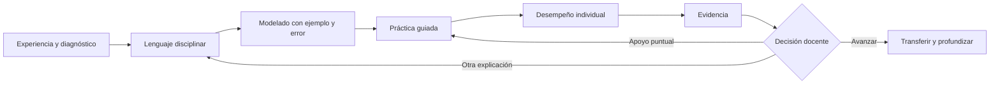
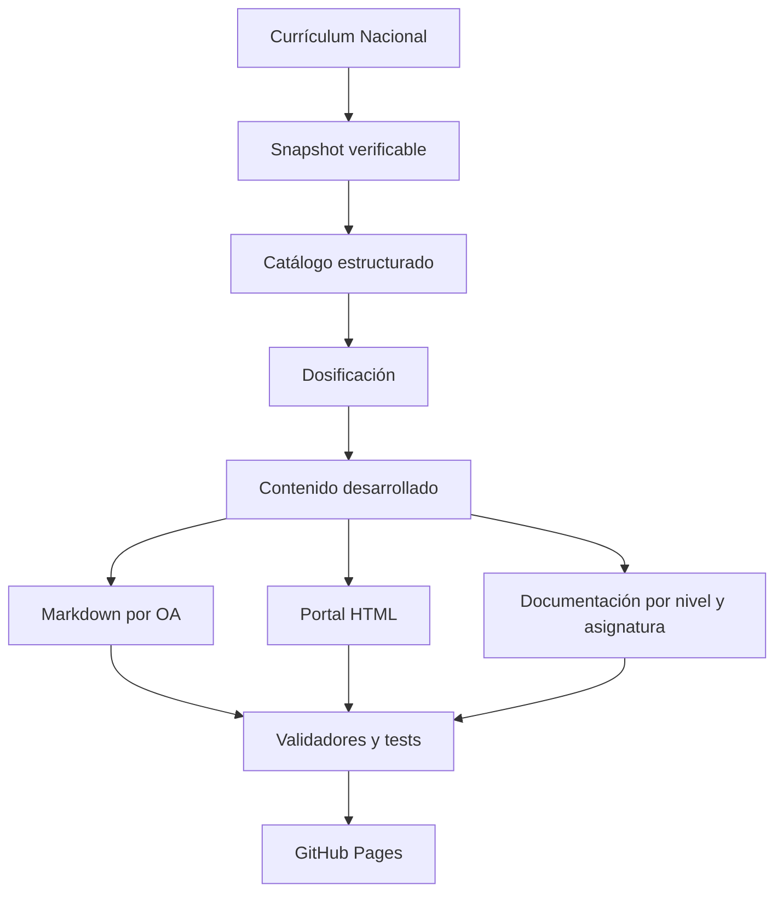

<div align="center">

# 🇨🇱 Trayectoria Escolar Chile

## **12.997 clases · 2.823 OA · 12 niveles · de 1° básico a 4° medio**

**Un currículo abierto y navegable que convierte los Objetivos de Aprendizaje de Chile en secuencias claras, adaptables y trazables.**

[](https://github.com/vladimiracunadev-create/chilean-school-learning-path/actions/workflows/pages.yml)

[](CURRICULUM.md)
[](CURRICULUM.md)
[](docs/1-basico/README.md)
[](EDITORIAL_STATUS.md)

[🌐 Abrir el portal](https://vladimiracunadev-create.github.io/chilean-school-learning-path/) · [📚 Documentación visual](https://vladimiracunadev-create.github.io/chilean-school-learning-path/documentacion.html) · [🧒 1° básico completo](https://vladimiracunadev-create.github.io/chilean-school-learning-path/levels/1-basico.html) · [📘 Syllabus](docs/SYLLABUS.md) · [🗺️ Roadmap](ROADMAP.md) · [🤝 Contribuir](CONTRIBUTING.md)

</div>

---

> **Transparencia editorial.** Las 12.997 clases están inventariadas, secuenciadas y publicadas. Hay **1.056 desarrolladas**: las 1.034 de 1° básico y 22 pilotos de otros niveles. Existen **0 clases declaradas como revisadas** porque todavía no se ha registrado revisión humana completa. Publicar no equivale a revisar.

## 🎯 Qué es este proyecto

Trayectoria Escolar Chile transforma el currículo oficial en un sistema práctico para docentes, equipos pedagógicos, familias y revisores. Cada OA conserva su fuente y se despliega en 4 a 7 clases identificadas de manera estable.

No entrega una frase genérica por clase. Una clase desarrollada contiene:

- propósito docente y meta en lenguaje estudiantil;
- conocimientos previos, vocabulario y error previsible;
- inicio, modelado, práctica guiada y desempeño individual;
- materiales y alternativa viable sin conectividad;
- apoyo que conserva el OA y profundización no mecánica;
- ticket, evidencia, criterios observables y decisión posterior;
- adaptación de 90 a 45 minutos;
- fuente curricular y estado editorial.

## 🧩 Qué problemas busca resolver

- Un OA oficial indica qué aprender, pero no siempre cómo convertirlo en una secuencia.
- Una actividad puede ser entretenida sin producir evidencia del aprendizaje.
- Las planificaciones extensas suelen ocultar qué observar y qué hacer después.
- Apoyar puede terminar reduciendo el OA; profundizar puede degenerar en más repetición.
- Un repositorio puede parecer completo solo porque tiene muchos archivos.
- La documentación puede quedar desincronizada de los datos y del portal.

El proyecto responde con trazabilidad, estructura estable, contenido disciplinar, validación automática y estados editoriales explícitos.

## 📍 Estado actual

| Estado | Clases | Qué significa |
|---|---:|---|
| Inventariada | 12.997 | OA, nivel, asignatura, eje y fuente identificados |
| Secuenciada | 12.997 | posición, fase y duración inicial propuestas |
| Desarrollada | 1.056 | contrato pedagógico y disciplinar completo |
| Revisada | 0 | control humano documentado |
| Publicada | 12.997 | Markdown y HTML navegables |

Consulta el [estado editorial completo](EDITORIAL_STATUS.md) y el [estándar de calidad](QUALITY_STANDARD.md).

## 🧒 1° básico · nivel desarrollado

1° básico es el primer nivel trabajado de principio a fin: **237 OA, 1.034 clases y 11 asignaturas**.

| Asignatura | OA | Clases | Guía narrativa |
|---|---:|---:|---|
| Artes Visuales | 12 | 52 | [Leer](docs/1-basico/artes-visuales.md) |
| Ciencias Naturales | 22 | 89 | [Leer](docs/1-basico/ciencias-naturales.md) |
| Educación Física y Salud | 19 | 80 | [Leer](docs/1-basico/educacion-fisica-salud.md) |
| Historia, Geografía y Ciencias Sociales | 31 | 132 | [Leer](docs/1-basico/historia-geografia-ciencias-sociales.md) |
| Inglés (Propuesta) | 18 | 85 | [Leer](docs/1-basico/ingles-propuesta.md) |
| Lengua y Cultura de los Pueblos Originarios Ancestrales | 33 | 147 | [Leer](docs/1-basico/lengua-cultura-pueblos-originarios-ancestrales.md) |
| Lenguaje y Comunicación | 33 | 160 | [Leer](docs/1-basico/lenguaje-comunicacion.md) |
| Matemática | 36 | 151 | [Leer](docs/1-basico/matematica.md) |
| Música | 14 | 57 | [Leer](docs/1-basico/musica.md) |
| Orientación | 8 | 35 | [Leer](docs/1-basico/orientacion.md) |
| Tecnología | 11 | 46 | [Leer](docs/1-basico/tecnologia.md) |

➡️ **[Abrir el programa completo de 1° básico](docs/1-basico/README.md)**

Cada guía de asignatura explica de qué trata, qué problemas pedagógicos resuelve, resultados, prerrequisitos, método disciplinar, estructura por ejes, recorrido OA por OA, evidencia, barreras frecuentes, acceso y profundización.

## 🧠 Cómo progresa una secuencia



El orden hace visible el aprendizaje. No obliga a avanzar por calendario: la evidencia real puede justificar mantener, acortar o ampliar una secuencia.

## 🧱 Anatomía de una clase desarrollada

| Sección | Pregunta que responde | Resultado |
|---|---|---|
| Propósito docente | ¿Qué debe conseguir la enseñanza? | intención profesional clara |
| Meta estudiantil | ¿Qué comprenderé o podré hacer? | lenguaje accesible |
| Inicio | ¿Qué saben y qué barrera aparece? | diagnóstico breve |
| Modelado | ¿Qué decisión experta debo hacer visible? | ejemplo y contraejemplo |
| Práctica guiada | ¿Cómo ensayamos con apoyo? | retroalimentación inmediata |
| Desempeño individual | ¿Qué puede hacer cada estudiante? | evidencia atribuible |
| Apoyo | ¿Cómo cambio el acceso sin bajar el OA? | andamiaje gradual |
| Profundización | ¿Cómo amplío sin mecanizar? | comparación o transferencia |
| Ticket | ¿Qué observo al cerrar? | respuesta breve |
| Criterios | ¿Qué cuenta como logro? | señales observables |
| Decisión posterior | ¿Qué hago mañana? | avanzar, reagrupar o reenseñar |

## 🧭 Cómo usarlo en seis pasos

1. Elige nivel, asignatura y OA en el [portal](https://vladimiracunadev-create.github.io/chilean-school-learning-path/).
2. Lee la guía de asignatura para entender la progresión.
3. Revisa todas las clases del OA antes de preparar una.
4. Define evidencia y criterios antes de elegir materiales.
5. Adapta acceso, contexto y duración a tu curso.
6. Enseña, recoge evidencia y decide el paso siguiente.

El [syllabus](docs/SYLLABUS.md) desarrolla el proceso completo y la [guía docente](TEACHING_GUIDE.md) acompaña la conducción de aula.

## 📊 Evaluación que conduce a una decisión

La [rúbrica transversal](docs/RUBRICA_EVALUACION.md) usa cuatro niveles descriptivos:

| Nivel | Lectura | Próxima acción |
|---|---|---|
| Logrado con autonomía | aplica y explica sin copiar | avanzar o transferir |
| En desarrollo | necesita apoyo puntual | practicar y retirar ayuda |
| Requiere otra vía de acceso | la barrera impide observar | cambiar representación o respuesta |
| Sin evidencia suficiente | no es posible concluir | ofrecer otra oportunidad |

No son notas automáticas. Sirven para organizar la intervención y volver a comprobar.

## ♿ Acceso sin reducción

Mantener el OA no significa pedir a todos lo mismo del mismo modo. Se puede:

- anticipar vocabulario;
- demostrar y fragmentar consignas;
- usar objetos, imágenes, gestos o tecnología de apoyo;
- permitir ensayo oral antes de escribir;
- variar agrupamientos y tiempos;
- aceptar vías de respuesta pertinentes al OA;
- retirar los apoyos gradualmente.

Cuando ya existe dominio, se profundiza comparando, justificando, creando, mejorando o transfiriendo.

## 🏠 Familias y comunidad

La [guía para familias](docs/GUIA_FAMILIAS.md) explica cómo leer una ficha, conversar sobre lo aprendido y acompañar sin convertir el hogar en una segunda jornada escolar.

En lengua y cultura de pueblos originarios, la propuesta debe ajustarse al territorio y al contexto lingüístico, evitando generalizaciones y promoviendo validación comunitaria.

## 📚 Documentación de principio a fin

| Documento | Contenido |
|---|---|
| [Centro documental](docs/README.md) | mapa completo y rutas |
| [Syllabus](docs/SYLLABUS.md) | público, resultados, estructura, ritmo y planificación |
| [Programa de 1° básico](docs/1-basico/README.md) | narrativa, asignaturas y progresión |
| [11 guías de asignatura](docs/1-basico/README.md) | recorrido OA por OA |
| [Guía pedagógica](TEACHING_GUIDE.md) | preparación, conducción y adaptación |
| [Rúbrica](docs/RUBRICA_EVALUACION.md) | evidencia y decisiones |
| [FAQ](docs/FAQ.md) | dudas, límites y uso |
| [Guía para familias](docs/GUIA_FAMILIAS.md) | acompañamiento |
| [Revisión humana](docs/REVISION_HUMANA.md) | protocolo, listas y registro |
| [Metodología](METHODOLOGY.md) | fuente, generación y validación |
| [Roadmap](ROADMAP.md) | avance nivel por nivel |
| [Contribución](CONTRIBUTING.md) | contrato editorial y flujo |

## 🗺️ Cobertura total

| Nivel | OA | Clases | Estado de desarrollo |
|---|---:|---:|---|
| 1° básico | 237 | 1.034 | completo |
| 2° básico | 247 | 1.072 | secuenciado |
| 3° básico | 257 | 1.136 | 11 clases piloto |
| 4° básico | 268 | 1.195 | 4 clases piloto |
| 5° básico | 295 | 1.340 | secuenciado |
| 6° básico | 301 | 1.374 | secuenciado |
| 7° básico | 275 | 1.275 | secuenciado |
| 8° básico | 253 | 1.201 | 7 clases piloto |
| 1° medio | 253 | 1.209 | secuenciado |
| 2° medio | 248 | 1.200 | secuenciado |
| 3° medio FG | 98 | 495 | secuenciado |
| 4° medio FG | 91 | 466 | secuenciado |
| **Total** | **2.823** | **12.997** | **1.056 desarrolladas** |

## 🔎 Fuente, generación y controles



Requiere Python 3.12:

```bash
python scripts/generate_school_program.py
python scripts/validate_school_program.py
python scripts/validate_licensing.py
python -m unittest discover -s tests -p "test_*.py" -v
```

El workflow regenera todo, exige diff vacío, compila scripts, ejecuta validadores y tests y solo entonces despliega Pages.

## 📖 Fuentes y derechos

El snapshot fue verificado el **2026-09-24** desde [Currículum Nacional](https://www.curriculumnacional.cl/curriculum/cursos-y-niveles). El catálogo conserva **595 enlaces de lectura** asociados por MINEDUC. Se enlazan recursos; no se reproducen obras protegidas ni se inventa obligatoriedad.

El software usa licencia MIT y el contenido educativo original CC BY-NC-SA 4.0. Consulta [LICENSING.md](LICENSING.md).

Proyecto independiente, sin representación del Ministerio de Educación de Chile.
