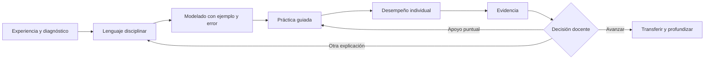
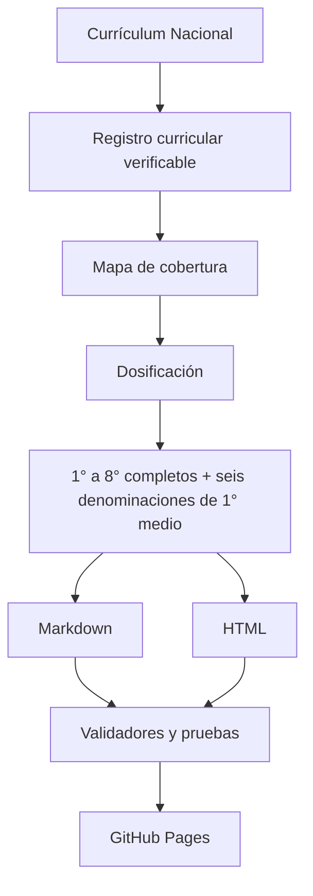

<div align="center">

# 🇨🇱 Trayectoria Escolar Chile

## **1° a 8° básico con desarrollo pedagógico interno completo**

### **Seis denominaciones de 1° medio también desarrolladas**

**Un proyecto abierto que transforma, OA por OA, el currículo chileno en clases claras, investigadas y pedagógicamente utilizables.**

[](https://github.com/vladimiracunadev-create/chilean-school-learning-path/actions/workflows/pages.yml)

[](docs/1-basico/README.md)
[](docs/2-basico/README.md)
[](docs/3-basico/README.md)
[](docs/4-basico/README.md)
[](docs/5-basico/README.md)
[](docs/6-basico/README.md)
[](docs/7-basico/README.md)
[](docs/8-basico/README.md)
[](docs/1-medio/README.md)
[](EDITORIAL_STATUS.md)

[](docs/COBERTURA.md)
[](docs/FORMATOS.md)

[](LICENSE)
[](LICENSE-CONTENT.md)

[🌐 Abrir portal público](https://vladimiracunadev-create.github.io/chilean-school-learning-path/) · [🧒 Abrir 1° básico](docs/1-basico/README.md) · [📐 Abrir 2° básico](docs/2-basico/README.md) · [🧭 Abrir 3° básico](docs/3-basico/README.md) · [🌎 Abrir 4° básico](docs/4-basico/README.md) · [🚀 Abrir 5° básico](docs/5-basico/README.md) · [🧪 Abrir 6° básico](docs/6-basico/README.md) · [📚 Abrir 7° básico completo](docs/7-basico/README.md) · [🎓 Abrir 8° básico completo](docs/8-basico/README.md) · [🏫 Abrir 1° medio](docs/1-medio/README.md) · [🗂️ Buscar un OA](CURRICULUM.md) · [📚 Centro documental](docs/README.md) · [🧭 Guía docente](TEACHING_GUIDE.md) · [📖 Glosario](docs/GLOSARIO.md) · [🤝 Contribuir](CONTRIBUTING.md)

[📋 Plan maestro por nivel, asignatura e ítem](docs/PLAN_DESARROLLO.md)

</div>

---

> [!IMPORTANT]
> **Estado real del proyecto:** 1° a 8° básico cuentan con desarrollo pedagógico interno completo. En 1° medio están desarrolladas Matemática, Lengua y Literatura, Ciencias Naturales, Historia, Inglés e Inglés (Propuesta), con 586 clases disciplinares y 339 experiencias integradas; otras cinco asignaturas conservan 284 propuestas pendientes. La revisión humana especializada sigue pendiente en todos los niveles.

> [!CAUTION]
> Proyecto educativo independiente. No representa al Ministerio de Educación de Chile ni reemplaza las Bases Curriculares, los Programas de Estudio, la planificación del establecimiento, las adecuaciones pertinentes o el juicio profesional. No publiques datos identificables de estudiantes.

## 👋 Empieza aquí

Este repositorio sirve hoy para cuatro cosas distintas, expresadas sin mezclar sus estados:

- **Usar el desarrollo completo de 1° básico:** ofrece 691 clases específicas organizadas en 153 secuencias disciplinares, todavía pendientes de revisión humana.
- **Usar 2° básico completo:** ofrece 721 clases específicas en 161 secuencias disciplinares y 351 experiencias que integran 86 OA transversales.
- **Usar 3° básico completo:** ofrece 757 clases específicas en 165 secuencias disciplinares y 379 experiencias que integran 92 OA transversales.
- **Usar 4° básico completo:** ofrece 811 clases específicas en 175 secuencias disciplinares y 384 experiencias que integran 93 OA transversales.
- **Usar 5° básico completo:** ofrece 920 clases específicas y 420 experiencias transversales integradas en doce denominaciones curriculares.
- **Usar 6° básico completo:** ofrece 952 clases específicas y 422 experiencias transversales integradas en doce denominaciones curriculares.
- **Usar 7° básico completo:** ofrece 760 clases disciplinares y 515 experiencias transversales integradas en doce denominaciones, sin propuestas pendientes en el nivel.
- **Usar 8° básico completo:** ofrece 771 clases disciplinares y 430 experiencias transversales integradas en doce denominaciones, sin propuestas pendientes en el nivel.
- **Usar las seis denominaciones desarrolladas de 1° medio:** ofrece 586 clases disciplinares y 339 experiencias integradas, con continuidad explícita desde 8° básico.
- **Consultar el currículo:** organiza 2.823 OA oficiales desde 1° básico hasta 4° medio.
- **Continuar Enseñanza Media:** conserva 2.445 propuestas pendientes: 284 en otras cinco asignaturas de 1° medio y 2.161 desde 2° hasta 4° medio.

Si vienes a preparar clases, abre el mapa de **[1°](docs/1-basico/README.md)**, **[2°](docs/2-basico/README.md)**, **[3°](docs/3-basico/README.md)**, **[4°](docs/4-basico/README.md)**, **[5°](docs/5-basico/README.md)**, **[6°](docs/6-basico/README.md)**, **[7°](docs/7-basico/README.md)**, **[8° básico completo](docs/8-basico/README.md)** o el núcleo de **[1° medio](docs/1-medio/README.md)** y comprueba el estado de cada ficha antes de usarla. Si necesitas saber qué está terminado y qué falta, consulta la **[cobertura editorial](docs/COBERTURA.md)**.

## 🧭 OA, en palabras simples

**OA significa Objetivo de Aprendizaje:** expresa qué debe llegar a comprender o hacer el estudiante. No es una clase, una actividad ni una página del repositorio.

Por ejemplo, `MA01 OA 01` significa Matemática · 1° básico · Objetivo de Aprendizaje 1. Cuando una secuencia alcanza el estado **desarrollada**, despliega el OA en clases con modelado, práctica, tareas, actividades complementarias y evidencia. Las fichas marcadas como **borrador** todavía no cumplen esa promesa. La guía **[¿Qué es un OA?](docs/QUE_ES_UN_OA.md)** explica el código.

## 🎯 Qué es este proyecto

Trayectoria Escolar Chile convierte el currículo oficial en decisiones concretas de enseñanza. Cada clase que el proyecto marca como desarrollada incluye:

- propósito docente y meta comprensible para estudiantes;
- conocimientos previos, vocabulario y errores previsibles;
- inicio, modelado, práctica guiada y desempeño individual;
- materiales y alternativa viable sin conectividad;
- recurso concreto listo para copiar, proyectar, representar o preparar;
- consigna exacta y referencia de respuesta para modelar y retroalimentar;
- apoyo que mantiene el OA y profundización que evita la repetición mecánica;
- ticket de salida, evidencia, criterios observables, pauta de cuatro niveles y decisión posterior;
- adaptación operativa de 90 a 45 minutos, distribuida en cinco tramos;
- tarea breve, flexible y sin compras obligatorias;
- actividades complementarias para recuperar, practicar o profundizar;
- dificultades del aula con acción inmediata y comprobación;
- coordinación entre docente, especialistas y equipos de apoyo;
- fuente curricular y estado editorial explícitos.

No es una colección de frases intercambiables. Las secuencias se ajustan a la asignatura, al OA, a la edad y a la evidencia esperada.

## 🧩 Qué problemas busca resolver

- Un OA oficial indica qué aprender, pero no siempre cómo llevarlo a una secuencia enseñable.
- Una actividad puede ser entretenida sin producir evidencia del aprendizaje.
- Apoyar puede terminar reduciendo el OA y profundizar puede convertirse en más ejercicios iguales.
- Una planificación extensa puede ocultar qué observar y qué hacer después.
- Un repositorio puede parecer completo por su cantidad de archivos aunque el contenido todavía sea preliminar.

La respuesta del proyecto es una estructura común, contenido disciplinar, trazabilidad, validación automática y estados editoriales que no confunden publicación con revisión humana.

## 📖 De dónde sale el contenido

El punto de partida es el [Currículum Nacional de Chile](https://www.curriculumnacional.cl/curriculum/cursos-y-niveles). El repositorio registra nivel, asignatura, eje, OA, URL oficial y fecha de comprobación.

- **[Fuentes oficiales](OFFICIAL_REFERENCES.md):** procedencia de OA, programas, lecturas y referencias legales.
- **[Reconstrucción de 1° básico](docs/1-basico/README.md):** cobertura, estado por asignatura y acceso a cada OA.
- **[Reconstrucción de 2° básico](docs/2-basico/README.md):** continuidad desde 1°, cobertura y acceso a sus once asignaturas.
- **[Reconstrucción de 3° básico](docs/3-basico/README.md):** continuidad, cobertura y acceso a sus once asignaturas.
- **[Reconstrucción de 4° básico](docs/4-basico/README.md):** continuidad desde 3°, cobertura y acceso a sus once asignaturas.
- **[Reconstrucción de 5° básico](docs/5-basico/README.md):** cobertura completa de sus doce denominaciones curriculares y continuidad desde 4°.
- **[Reconstrucción de 6° básico](docs/6-basico/README.md):** cobertura completa de sus doce denominaciones y continuidad desde 5°.
- **[Reconstrucción de 7° básico](docs/7-basico/README.md):** cobertura completa, cambio a Lengua y Literatura y continuidad desde 6°.
- **[Reconstrucción de 8° básico](docs/8-basico/README.md):** cobertura completa de sus doce denominaciones y continuidad desde 7°.
- **[Seis denominaciones de 1° medio](docs/1-medio/README.md):** desarrollo completo de Matemática, Lengua y Literatura, Ciencias Naturales, Historia y dos denominaciones de Inglés, con estado explícito de las materias pendientes.
- **[Metodología](METHODOLOGY.md):** paso del OA a la secuencia y controles de consistencia.
- **[Cobertura](docs/COBERTURA.md):** alcance de los doce niveles y estado editorial real.
- **[Licencias](docs/LICENCIAS.md):** derechos, atribución y condiciones de reutilización.

El registro curricular fue comprobado el **2026-09-24** y conserva 595 enlaces de lectura asociados desde fichas oficiales. Esos enlaces son referencias: el repositorio no reproduce las obras ni las declara obligatorias.

## 📍 Estado actual

### Desarrollado hasta ahora

**1° básico:** 691 clases desarrolladas en las 11 asignaturas y 343 experiencias transversales integradas, sin duplicar el conteo. Las 1.034 entradas del nivel están resueltas como contenido disciplinar o integración; quedan **0 borradores**. Todo está disponible en Markdown y HTML y mantiene **revisión humana pendiente**.

**2° básico:** 721 clases desarrolladas en las 11 asignaturas y 351 experiencias transversales integradas, sin duplicar el conteo. Las 1.072 entradas del nivel están resueltas y quedan **0 propuestas pendientes**, con revisión humana aún pendiente.

**3° básico:** 757 clases desarrolladas en las 11 asignaturas y 379 experiencias transversales integradas, sin duplicar el conteo. Las 1.136 entradas del nivel están resueltas y quedan **0 propuestas pendientes**, con revisión humana aún pendiente.

**4° básico:** 811 clases desarrolladas en las 11 asignaturas y 384 experiencias transversales integradas, sin duplicar el conteo. Las 1.195 entradas del nivel están resueltas y quedan **0 propuestas pendientes**, con revisión humana aún pendiente.

**5° básico:** 920 clases desarrolladas y 420 experiencias transversales integradas en doce denominaciones curriculares. Las 1.340 entradas del nivel están resueltas y quedan **0 propuestas pendientes**, con revisión humana aún pendiente.

**6° básico:** nivel completo con 952 clases desarrolladas, 422 experiencias integradas y doce denominaciones curriculares. Las 1.374 entradas del nivel están resueltas y quedan **0 propuestas pendientes**, con revisión humana aún pendiente.

**7° básico completo:** 760 clases disciplinares desarrolladas y 515 experiencias transversales integradas. Los 153 objetivos de contenido y 122 objetivos transversales del nivel están resueltos en sus doce denominaciones, con revisión humana aún pendiente.

**8° básico completo:** las doce denominaciones curriculares reúnen 771 clases disciplinares y 430 experiencias integradas. Matemática aporta 77 + 82; Lengua y Literatura, 155 + 33; Ciencias, 74 + 89; Historia, 117 + 91; Artes, 29 + 33; Música, 30 + 37; Educación Física, 26 + 28; Orientación, 49 + 0; Tecnología, 26 + 16; Inglés, 80 + 21; Inglés (Propuesta), 65 + 0; y Lengua Indígena, 43 + 0. Quedan 0 propuestas pendientes en el nivel.

**1° medio en desarrollo:** Matemática aporta 66 clases disciplinares y 89 experiencias integradas; Lengua y Literatura, 143 y 33; Ciencias Naturales, 100 y 93; Historia, 132 y 103; Inglés, 80 y 21; e Inglés (Propuesta), 65 clases desarrolladas. Estas seis denominaciones están completas y documentadas. Otras cinco asignaturas conservan 284 propuestas secuenciadas, por lo que el nivel no se declara completo.

### Preparado para desarrollo futuro

**En 1° medio:** 284 propuestas de otras cinco asignaturas permanecen secuenciadas. **Desde 2° hasta 4° medio:** las 2.161 propuestas continúan secuenciadas. Ninguno de esos niveles se presenta como desarrollo completo.

### Lo que significa “12.997”

Es la suma de todos los **espacios de clase inventariados** del mapa curricular. No significa que existan 12.997 planificaciones pedagógicas terminadas. El detalle auditable vive en [Estado editorial](EDITORIAL_STATUS.md), no en una cifra promocional.

## 🧒 1° básico · desarrollo OA por OA

**691 clases disciplinares · 343 experiencias integradas · 237 OA · 11 asignaturas · 0 borradores.** El nivel construye oralidad, lectura y escritura inicial, número, observación del entorno, orientación temporal y espacial, expresión, movimiento, convivencia, identidad y diseño. Todas sus guías cuentan con secuencias específicas; la revisión humana especializada sigue pendiente.

- 🎨 **[Artes Visuales](docs/1-basico/artes-visuales.md):** 5 OA de contenido y 24 clases desarrolladas; 7 OA de actitudes se integran mediante 28 experiencias.
- 🌱 **[Ciencias Naturales](docs/1-basico/ciencias-naturales.md):** 12 OA de contenido y 49 clases desarrolladas; 10 OA de habilidades/actitudes se integran mediante 40 experiencias.
- 🏃 **[Educación Física y Salud](docs/1-basico/educacion-fisica-salud.md):** 11 OA de contenido y 48 clases desarrolladas; 8 OA de actitudes se integran mediante 32 experiencias.
- 🗺️ **[Historia, Geografía y Ciencias Sociales](docs/1-basico/historia-geografia-ciencias-sociales.md):** 15 OA de contenido y 68 clases desarrolladas; 16 OA de habilidades/actitudes se integran mediante 64 experiencias.
- 🌍 **[Inglés — propuesta](docs/1-basico/ingles-propuesta.md):** 14 OA de contenido y 69 clases desarrolladas; 4 OA de actitudes se integran mediante 16 experiencias.
- 🪶 **[Lengua y Cultura de los Pueblos Originarios Ancestrales](docs/1-basico/lengua-cultura-pueblos-originarios-ancestrales.md):** 29 OA de contenido y 129 clases desarrolladas; 4 OA de actitudes se integran mediante 18 experiencias, con resguardos de fuente, comunidad y no apropiación.
- 📚 **[Lenguaje y Comunicación](docs/1-basico/lenguaje-comunicacion.md):** 26 OA de contenido y 131 clases desarrolladas; 7 OA de actitudes se integran mediante 29 experiencias transversales.
- 🔢 **[Matemática](docs/1-basico/matematica.md):** 20 OA de contenido y 83 clases desarrolladas; 16 OA de habilidades/actitudes se integran mediante 68 experiencias transversales.
- 🎵 **[Música](docs/1-basico/musica.md):** 7 OA de contenido y 29 clases desarrolladas; 7 OA de actitudes se integran mediante 28 experiencias.
- 💬 **[Orientación](docs/1-basico/orientacion.md):** 8 OA de contenido y 35 clases desarrolladas, con casos ficticios y resguardo de privacidad.
- 🛠️ **[Tecnología](docs/1-basico/tecnologia.md):** 6 OA de contenido y 26 clases desarrolladas; 5 OA de actitudes se integran mediante 20 experiencias.

## 📐 2° básico · desarrollo OA por OA

**721 clases disciplinares · 351 experiencias integradas · 247 OA · 11 asignaturas · 0 propuestas pendientes.** El nivel consolida los aprendizajes iniciados en 1° y aumenta rango, precisión y autonomía sin suponer bases automatizadas. Sus 161 OA de contenido cuentan con secuencias propias; 86 OA de habilidades y actitudes se integran sin duplicar clases. La revisión humana especializada sigue pendiente.

- 🎨 **[Artes Visuales](docs/2-basico/artes-visuales.md):** 5 OA de contenido y 24 clases desarrolladas; 7 OA de actitudes se integran mediante 28 experiencias.
- 🌱 **[Ciencias Naturales](docs/2-basico/ciencias-naturales.md):** 14 OA de contenido y 57 clases desarrolladas; 11 OA de habilidades/actitudes se integran mediante 44 experiencias.
- 🏃 **[Educación Física y Salud](docs/2-basico/educacion-fisica-salud.md):** 11 OA de contenido y 47 clases desarrolladas; 8 OA de actitudes se integran mediante 32 experiencias.
- 🗺️ **[Historia, Geografía y Ciencias Sociales](docs/2-basico/historia-geografia-ciencias-sociales.md):** 16 OA de contenido y 72 clases desarrolladas; 18 OA de habilidades/actitudes se integran mediante 72 experiencias.
- 🌍 **[Inglés — propuesta](docs/2-basico/ingles-propuesta.md):** 14 OA de contenido y 68 clases desarrolladas; 4 OA de actitudes se integran mediante 16 experiencias.
- 🪶 **[Lengua y Cultura de los Pueblos Originarios Ancestrales](docs/2-basico/lengua-cultura-pueblos-originarios-ancestrales.md):** 27 OA de contenido y 116 clases desarrolladas; 4 OA de actitudes se integran mediante 18 experiencias, con resguardos de fuente, comunidad y no apropiación.
- 📚 **[Lenguaje y Comunicación](docs/2-basico/lenguaje-comunicacion.md):** 30 OA de contenido y 149 clases desarrolladas; 7 OA de actitudes se integran mediante 29 experiencias transversales.
- 🔢 **[Matemática](docs/2-basico/matematica.md):** 22 OA de contenido y 93 clases desarrolladas; 15 OA de habilidades/actitudes se integran mediante 64 experiencias transversales.
- 🎵 **[Música](docs/2-basico/musica.md):** 7 OA de contenido y 29 clases desarrolladas; 7 OA de actitudes se integran mediante 28 experiencias.
- 💬 **[Orientación](docs/2-basico/orientacion.md):** 8 OA de contenido y 35 clases desarrolladas, con casos ficticios y resguardo de privacidad.
- 🛠️ **[Tecnología](docs/2-basico/tecnologia.md):** 7 OA de contenido y 31 clases desarrolladas; 5 OA de actitudes se integran mediante 20 experiencias.

## 🧭 3° básico · desarrollo OA por OA

**757 clases disciplinares · 379 experiencias integradas · 257 OA · 11 asignaturas · 0 propuestas pendientes.** El nivel amplía autonomía, precisión y justificación sin retirar apoyos por calendario. Cada asignatura mantiene su método, su evidencia propia y continuidad explícita con 2° básico.

- 🎨 **[Artes Visuales](docs/3-basico/artes-visuales.md):** 25 clases desarrolladas y 28 experiencias integradas.
- 🌱 **[Ciencias Naturales](docs/3-basico/ciencias-naturales.md):** 55 clases desarrolladas y 49 experiencias integradas.
- 🏃 **[Educación Física y Salud](docs/3-basico/educacion-fisica-salud.md):** 48 clases desarrolladas y 32 experiencias integradas.
- 🗺️ **[Historia, Geografía y Ciencias Sociales](docs/3-basico/historia-geografia-ciencias-sociales.md):** 72 clases desarrolladas y 72 experiencias integradas.
- 🌍 **[Inglés — propuesta](docs/3-basico/ingles-propuesta.md):** 69 clases desarrolladas y 16 experiencias integradas.
- 🪶 **[Lengua y Cultura de los Pueblos Originarios Ancestrales](docs/3-basico/lengua-cultura-pueblos-originarios-ancestrales.md):** 116 clases desarrolladas y 18 experiencias integradas, con resguardos culturales.
- 📚 **[Lenguaje y Comunicación](docs/3-basico/lenguaje-comunicacion.md):** 157 clases desarrolladas y 29 experiencias integradas.
- 🔢 **[Matemática](docs/3-basico/matematica.md):** 112 clases desarrolladas y 87 experiencias integradas.
- 🎵 **[Música](docs/3-basico/musica.md):** 35 clases desarrolladas y 28 experiencias integradas.
- 💬 **[Orientación](docs/3-basico/orientacion.md):** 35 clases desarrolladas, con casos ficticios, privacidad y protocolos de resguardo.
- 🛠️ **[Tecnología](docs/3-basico/tecnologia.md):** 33 clases desarrolladas y 20 experiencias integradas.

## 🌎 4° básico · desarrollo OA por OA

**811 clases disciplinares · 384 experiencias integradas · 268 OA · 11 asignaturas · 0 propuestas pendientes.** El nivel consolida el primer ciclo con clases diferenciadas por método, evidencia y resguardo disciplinar.

- 🎨 **[Artes Visuales](docs/4-basico/artes-visuales.md):** 25 clases desarrolladas y 28 experiencias integradas.
- 🌱 **[Ciencias Naturales](docs/4-basico/ciencias-naturales.md):** 71 clases desarrolladas y 49 experiencias integradas.
- 🏃 **[Educación Física y Salud](docs/4-basico/educacion-fisica-salud.md):** 49 clases desarrolladas y 32 experiencias integradas.
- 🗺️ **[Historia, Geografía y Ciencias Sociales](docs/4-basico/historia-geografia-ciencias-sociales.md):** 82 clases desarrolladas y 77 experiencias integradas.
- 🌍 **[Inglés — propuesta](docs/4-basico/ingles-propuesta.md):** 69 clases desarrolladas y 16 experiencias integradas.
- 🪶 **[Lengua y Cultura de los Pueblos Originarios Ancestrales](docs/4-basico/lengua-cultura-pueblos-originarios-ancestrales.md):** 126 clases desarrolladas y 18 experiencias integradas, con resguardos culturales.
- 📚 **[Lenguaje y Comunicación](docs/4-basico/lenguaje-comunicacion.md):** 161 clases desarrolladas y 29 experiencias integradas.
- 🔢 **[Matemática](docs/4-basico/matematica.md):** 118 clases desarrolladas y 87 experiencias integradas.
- 🎵 **[Música](docs/4-basico/musica.md):** 35 clases desarrolladas y 28 experiencias integradas.
- 💬 **[Orientación](docs/4-basico/orientacion.md):** 40 clases desarrolladas, con casos ficticios, privacidad y protocolos de resguardo.
- 🛠️ **[Tecnología](docs/4-basico/tecnologia.md):** 35 clases desarrolladas y 20 experiencias integradas.

## 🚀 5° básico · desarrollo OA por OA

**920 clases disciplinares · 420 experiencias integradas · 12 denominaciones curriculares completas.** El nivel aumenta rango, autonomía y argumentación desde la base de 4°, con 0 propuestas pendientes y revisión humana todavía pendiente.

- 🔢 **[Matemática](docs/5-basico/matematica.md):** 115 clases desarrolladas y 86 experiencias integradas.
- 📚 **[Lenguaje y Comunicación](docs/5-basico/lenguaje-comunicacion.md):** 166 clases desarrolladas y 29 experiencias integradas.
- 🌱 **[Ciencias Naturales](docs/5-basico/ciencias-naturales.md):** 64 clases desarrolladas y 58 experiencias integradas.
- 🗺️ **[Historia, Geografía y Ciencias Sociales](docs/5-basico/historia-geografia-ciencias-sociales.md):** 106 clases desarrolladas y 91 experiencias integradas.
- 🎨 **[Artes Visuales](docs/5-basico/artes-visuales.md):** 27 clases desarrolladas y 28 experiencias integradas.
- 🎵 **[Música](docs/5-basico/musica.md):** 35 clases desarrolladas y 28 experiencias integradas.
- 🏃 **[Educación Física y Salud](docs/5-basico/educacion-fisica-salud.md):** 49 clases desarrolladas y 32 experiencias integradas.
- 💬 **[Orientación](docs/5-basico/orientacion.md):** 41 clases desarrolladas con resguardos de intimidad y protección.
- 🛠️ **[Tecnología](docs/5-basico/tecnologia.md):** 35 clases desarrolladas y 20 experiencias integradas.
- 🌐 **[Inglés](docs/5-basico/ingles.md):** 76 clases desarrolladas y 16 experiencias integradas.
- 🌍 **[Inglés — propuesta](docs/5-basico/ingles-propuesta.md):** 71 clases desarrolladas y 32 experiencias integradas.
- 🪶 **[Lengua y Cultura de los Pueblos Originarios Ancestrales](docs/5-basico/lengua-cultura-pueblos-originarios-ancestrales.md):** 135 clases desarrolladas con resguardos culturales.

## 🧪 6° básico · desarrollo OA por OA

**952 clases disciplinares · 422 experiencias integradas · 301 OA · 12 denominaciones curriculares · 0 propuestas pendientes.** El nivel consolida el segundo ciclo con mayor formalización, contraste de evidencia, autonomía y transferencia, sin retirar apoyos por calendario.

- 🎨 **[Artes Visuales](docs/6-basico/artes-visuales.md):** 27 clases desarrolladas y 28 experiencias integradas.
- 🌱 **[Ciencias Naturales](docs/6-basico/ciencias-naturales.md):** 78 clases desarrolladas y 53 experiencias integradas.
- 🏃 **[Educación Física y Salud](docs/6-basico/educacion-fisica-salud.md):** 50 clases desarrolladas y 32 experiencias integradas.
- 🗺️ **[Historia, Geografía y Ciencias Sociales](docs/6-basico/historia-geografia-ciencias-sociales.md):** 116 clases desarrolladas y 96 experiencias integradas.
- 🌐 **[Inglés](docs/6-basico/ingles.md):** 76 clases desarrolladas y 16 experiencias integradas.
- 🌍 **[Inglés — propuesta](docs/6-basico/ingles-propuesta.md):** 74 clases desarrolladas y 32 experiencias integradas.
- 🪶 **[Lengua y Cultura de los Pueblos Originarios Ancestrales](docs/6-basico/lengua-cultura-pueblos-originarios-ancestrales.md):** 144 clases desarrolladas con resguardos culturales.
- 📚 **[Lenguaje y Comunicación](docs/6-basico/lenguaje-comunicacion.md):** 176 clases desarrolladas y 29 experiencias integradas.
- 🔢 **[Matemática](docs/6-basico/matematica.md):** 98 clases desarrolladas y 88 experiencias integradas.
- 🎵 **[Música](docs/6-basico/musica.md):** 35 clases desarrolladas y 28 experiencias integradas.
- 💬 **[Orientación](docs/6-basico/orientacion.md):** 41 clases desarrolladas con resguardos de intimidad y protección.
- 🛠️ **[Tecnología](docs/6-basico/tecnologia.md):** 37 clases desarrolladas y 20 experiencias integradas.

## 📚 7° básico · desarrollo OA por OA

**760 clases disciplinares · 515 experiencias integradas · 275 OA · 12 denominaciones curriculares · 0 propuestas pendientes.** El nivel inicia el tramo de 7° básico a 2° medio con Lengua y Literatura, Lengua Indígena, mayor argumentación y decisiones disciplinares más autónomas.

- 🎨 **[Artes Visuales](docs/7-basico/artes-visuales.md):** 29 clases desarrolladas y 33 experiencias integradas.
- 🌱 **[Ciencias Naturales](docs/7-basico/ciencias-naturales.md):** 72 clases desarrolladas y 89 experiencias integradas.
- 🏃 **[Educación Física y Salud](docs/7-basico/educacion-fisica-salud.md):** 25 clases desarrolladas y 28 experiencias integradas.
- 🗺️ **[Historia, Geografía y Ciencias Sociales](docs/7-basico/historia-geografia-ciencias-sociales.md):** 113 clases desarrolladas y 91 experiencias integradas.
- 🌐 **[Inglés](docs/7-basico/ingles.md):** 80 clases desarrolladas y 21 experiencias integradas.
- 🌍 **[Inglés — propuesta](docs/7-basico/ingles-propuesta.md):** 65 clases desarrolladas y 85 experiencias integradas.
- 🪶 **[Lengua Indígena](docs/7-basico/lengua-indigena.md):** 41 clases desarrolladas con resguardos culturales.
- 📚 **[Lengua y Literatura](docs/7-basico/lengua-literatura.md):** 147 clases desarrolladas y 33 experiencias integradas.
- 🔢 **[Matemática](docs/7-basico/matematica.md):** 83 clases desarrolladas y 82 experiencias integradas.
- 🎵 **[Música](docs/7-basico/musica.md):** 30 clases desarrolladas y 37 experiencias integradas.
- 💬 **[Orientación](docs/7-basico/orientacion.md):** 49 clases desarrolladas con resguardos de intimidad y protección.
- 🛠️ **[Tecnología](docs/7-basico/tecnologia.md):** 26 clases desarrolladas y 16 experiencias integradas.

## 🎓 8° básico · desarrollo OA por OA

**771 clases disciplinares · 430 experiencias integradas · 253 OA · 12 denominaciones curriculares · 0 propuestas pendientes.** El nivel completa Educación Básica con continuidad explícita desde 7°, desempeño individual, evidencia observable y resguardos disciplinares, culturales, físicos, emocionales y digitales.

- 🎨 **[Artes Visuales](docs/8-basico/artes-visuales.md):** 29 clases desarrolladas y 33 experiencias integradas.
- 🌱 **[Ciencias Naturales](docs/8-basico/ciencias-naturales.md):** 74 clases desarrolladas y 89 experiencias integradas.
- 🏃 **[Educación Física y Salud](docs/8-basico/educacion-fisica-salud.md):** 26 clases desarrolladas y 28 experiencias integradas.
- 🗺️ **[Historia, Geografía y Ciencias Sociales](docs/8-basico/historia-geografia-ciencias-sociales.md):** 117 clases desarrolladas y 91 experiencias integradas.
- 🌐 **[Inglés](docs/8-basico/ingles.md):** 80 clases desarrolladas y 21 experiencias integradas.
- 🌍 **[Inglés — propuesta](docs/8-basico/ingles-propuesta.md):** 65 clases desarrolladas.
- 🪶 **[Lengua Indígena](docs/8-basico/lengua-indigena.md):** 43 clases desarrolladas con resguardos culturales.
- 📚 **[Lengua y Literatura](docs/8-basico/lengua-literatura.md):** 155 clases desarrolladas y 33 experiencias integradas.
- 🔢 **[Matemática](docs/8-basico/matematica.md):** 77 clases desarrolladas y 82 experiencias integradas.
- 🎵 **[Música](docs/8-basico/musica.md):** 30 clases desarrolladas y 37 experiencias integradas.
- 💬 **[Orientación](docs/8-basico/orientacion.md):** 49 clases desarrolladas con resguardos de intimidad y protección.
- 🛠️ **[Tecnología](docs/8-basico/tecnologia.md):** 26 clases desarrolladas y 16 experiencias integradas.

## 🏫 1° medio · seis denominaciones desarrolladas

**586 clases disciplinares · 339 experiencias integradas · 113 OA de contenido + 78 OA transversales · 6 denominaciones completas · 284 propuestas pendientes en otras cinco asignaturas.** Este desarrollo de Enseñanza Media aumenta formalización, lectura crítica, investigación, producción y autonomía, conservando continuidad explícita desde 8° básico.

- 🔢 **[Matemática](docs/1-medio/matematica.md):** 15 OA de contenido y 66 clases desarrolladas; 21 OA de habilidades y actitudes se integran mediante 89 experiencias.
- 📚 **[Lengua y Literatura](docs/1-medio/lengua-literatura.md):** 24 OA de contenido y 143 clases desarrolladas; 8 OA de actitudes se integran mediante 33 experiencias.
- 🧪 **[Ciencias Naturales](docs/1-medio/ciencias-naturales.md):** 20 OA de contenido y 100 clases desarrolladas; 21 OA de habilidades y actitudes se integran mediante 93 experiencias.
- 🗺️ **[Historia, Geografía y Ciencias Sociales](docs/1-medio/historia-geografia-ciencias-sociales.md):** 25 OA de contenido y 132 clases desarrolladas; 23 OA de habilidades y actitudes se integran mediante 103 experiencias.
- 🌐 **[Inglés](docs/1-medio/ingles.md):** 16 OA de contenido y 80 clases desarrolladas; 5 OA de actitudes se integran mediante 21 experiencias.
- 🌍 **[Inglés (Propuesta)](docs/1-medio/ingles-propuesta.md):** 13 OA de contenido y 65 clases desarrolladas.

[Abrir el índice completo de 1° medio](docs/1-medio/README.md) para distinguir las seis denominaciones desarrolladas de las cinco asignaturas que permanecen secuenciadas.

## 🔧 Cómo se mejora el contenido desarrollado

Una mejora de cualquier nivel entre 1° y 8° básico, o de las asignaturas desarrolladas de 1° medio, se aplica al contenido pedagógico canónico, no sólo a la portada o a una página aislada. El flujo correcto es:

1. delimitar el nivel, la asignatura, el OA, la clase o el aspecto transversal que debe mejorar;
2. corregir propósito, explicación, actividades, tareas, evidencia, dificultades y apoyos donde corresponda;
3. regenerar sus versiones Markdown y HTML desde la misma fuente;
4. conservar códigos y anclas estables para no romper enlaces;
5. ejecutar validadores, pruebas y comprobación de reproducibilidad;
6. mantener el estado “pendiente de revisión humana” hasta que una revisión competente quede registrada.

Si la solicitud es general —por ejemplo, “mejora todas las clases de Matemática de 2°”— se trabaja sistemáticamente OA por OA dentro del nivel indicado. No se simula avance en otros niveles ni se aumentan conteos por cambiar documentación.

## 🧠 Cómo progresa una secuencia


```mermaid
flowchart LR
    A[Experiencia y diagnóstico] --> B[Lenguaje disciplinar]
    B --> C[Modelado con ejemplo y error]
    C --> D[Práctica guiada]
    D --> E[Desempeño individual]
    E --> F[Evidencia]
    F --> G{Decisión docente}
    G -->|Avanzar| H[Transferir y profundizar]
    G -->|Apoyo puntual| D
    G -->|Otra explicación| B
```

La secuencia no obliga a avanzar por calendario. La evidencia puede justificar mantener, acortar, ampliar o volver a explicar.

## 🧱 Anatomía de una clase desarrollada

**Antes de enseñar:** propósito, meta estudiantil, conocimientos previos, vocabulario, materiales y preparación.

**Durante la clase:** inicio diagnóstico, modelado explícito, práctica guiada, desempeño individual, apoyo y profundización.

**Para cerrar:** ticket de salida, evidencia atribuible, criterios observables y decisión para la clase siguiente.

**Para sostener el aprendizaje:** tarea flexible, actividades complementarias, acciones frente a dificultades y coordinación de roles profesionales.

## 🧰 Caja de herramientas pedagógicas

- 📖 **[Glosario educativo](docs/GLOSARIO.md):** OA, eje, cobertura, evidencia, criterio, apoyo y profundización.
- 🧩 **[Actividades y tareas](TEACHING_GUIDE.md#tareas-y-actividades-complementarias):** alternativas diferenciadas en cada clase desarrollada.
- ⚠️ **[Dificultades con acciones](docs/DIFICULTADES_EN_EL_AULA.md):** señal observable → acción inmediata → comprobación → decisión.
- 👥 **[Roles profesionales](docs/ROLES_DOCENTES.md):** docente, especialistas, educación diferencial, asistentes, CRA y convivencia.
- 📊 **[Rúbrica transversal](docs/RUBRICA_EVALUACION.md):** lectura de evidencia y acción pedagógica asociada.
- ♿ **[Evaluación formativa](docs/EVALUACION_FORMATIVA.md):** cambiar el acceso sin reducir el OA.
- 🏠 **[Guía para familias](docs/GUIA_FAMILIAS.md):** acompañar sin reemplazar al estudiante.
- 🔎 **[Revisión humana](docs/REVISION_HUMANA.md):** registrar una revisión real y trazable.

## 🧭 Rutas según quién usa el repositorio

- **Docente de Educación Básica:** empieza en el programa de [1°](docs/1-basico/README.md), [2°](docs/2-basico/README.md), [3°](docs/3-basico/README.md), [4°](docs/4-basico/README.md), [5°](docs/5-basico/README.md), [6°](docs/6-basico/README.md), [7°](docs/7-basico/README.md) u [8°](docs/8-basico/README.md) y continúa con la guía de su asignatura.
- **Docente de 1° medio:** abre el [índice del nivel](docs/1-medio/README.md) y entra a [Matemática](docs/1-medio/matematica.md) o [Lengua y Literatura](docs/1-medio/lengua-literatura.md); las otras asignaturas todavía figuran como pendientes.
- **Docente especialista:** revisa la progresión disciplinar y luego abre el OA en el [índice curricular](CURRICULUM.md).
- **Educación diferencial o equipo de apoyo:** acuerda responsabilidades en [Roles profesionales](docs/ROLES_DOCENTES.md) y selecciona acciones en [Dificultades en el aula](docs/DIFICULTADES_EN_EL_AULA.md).
- **Coordinación pedagógica o UTP:** contrasta [Cobertura](docs/COBERTURA.md), [Estado editorial](EDITORIAL_STATUS.md) y [Estándar de calidad](QUALITY_STANDARD.md).
- **Familias y personas cuidadoras:** utiliza la [Guía para familias](docs/GUIA_FAMILIAS.md).
- **Revisión o contribución:** lee [Metodología](METHODOLOGY.md), [Revisión humana](docs/REVISION_HUMANA.md) y [Cómo contribuir](CONTRIBUTING.md).

## 👩‍🏫 Para docentes y equipos pedagógicos

### Cómo usarlo en seis pasos

1. Elige una asignatura y un OA desde el índice completo de [1°](docs/1-basico/README.md), [2°](docs/2-basico/README.md), [3°](docs/3-basico/README.md), [4°](docs/4-basico/README.md), [5°](docs/5-basico/README.md), [6°](docs/6-basico/README.md), [7°](docs/7-basico/README.md), [8° básico](docs/8-basico/README.md) o desde las seis denominaciones desarrolladas de [1° medio](docs/1-medio/README.md).
2. Lee la secuencia completa del OA antes de preparar una clase.
3. Define la evidencia y los criterios que observarás.
4. Ajusta contexto, materiales, acceso y duración al curso real.
5. Enseña y recoge evidencia individual, no solo participación grupal.
6. Decide si avanzar, reagrupar, ofrecer otra vía o reenseñar.

El [syllabus](docs/SYLLABUS.md) ayuda a organizar el año y la [guía docente](TEACHING_GUIDE.md) acompaña la preparación, conducción y adaptación.

## 📊 Evaluación que conduce a una decisión

- **Logrado con autonomía:** avanzar o transferir.
- **En desarrollo:** practicar con apoyo puntual y retirarlo gradualmente.
- **Requiere otra vía de acceso:** cambiar representación, ejemplo o forma de respuesta.
- **Sin evidencia suficiente:** ofrecer otra oportunidad antes de concluir.

Estas categorías no asignan notas automáticas. Organizan la intervención y la comprobación posterior.

## ♿ Acceso sin reducción

Mantener el OA no significa pedir a todos lo mismo del mismo modo. Se puede anticipar vocabulario, fragmentar consignas, usar objetos o imágenes, permitir ensayo oral, variar agrupamientos y tiempos, y aceptar distintas vías de respuesta pertinentes. Cuando existe dominio, se profundiza comparando, justificando, creando, mejorando o transfiriendo.

## 🏠 Familias y comunidad

La [guía para familias](docs/GUIA_FAMILIAS.md) explica cómo leer una clase, conversar sobre lo aprendido y acompañar sin convertir el hogar en una segunda jornada escolar.

En lengua y cultura de pueblos originarios, toda propuesta debe ajustarse al territorio y al contexto lingüístico, evitar generalizaciones y promover validación comunitaria.

## 🌐 Portal, navegación y formatos

El [portal público de GitHub Pages](https://vladimiracunadev-create.github.io/chilean-school-learning-path/) ofrece búsqueda por palabra, OA o código; filtros por nivel y asignatura; enlaces estables; navegación entre objetivos; tema claro u oscuro; y diseño adaptable. Funciona sin cuentas, telemetría ni envío de datos personales.

El repositorio conserva una separación deliberada:

- los documentos Markdown enlazan a otros documentos Markdown para edición e historial;
- el sitio de GitHub Pages enlaza a páginas HTML para lectura web;
- ambos formatos se generan desde la misma fuente y comparten identificadores.

Consulta [Formatos](docs/FORMATOS.md) para entender la correspondencia o [descarga el repositorio](https://github.com/vladimiracunadev-create/chilean-school-learning-path/archive/refs/heads/main.zip) para usarlo sin conexión.

## 📚 Documentación de principio a fin

### Comprender el programa

- [Centro documental](docs/README.md)
- [Syllabus de 1° a 8° básico](docs/SYLLABUS.md)
- [¿Qué es un OA?](docs/QUE_ES_UN_OA.md)
- [Glosario educativo](docs/GLOSARIO.md)
- [Preguntas frecuentes](docs/FAQ.md)

### Enseñar, adaptar y evaluar

- [Programa de 1° básico](docs/1-basico/README.md)
- [Programa de 2° básico](docs/2-basico/README.md)
- [Programa de 3° básico](docs/3-basico/README.md)
- [Programa de 4° básico](docs/4-basico/README.md)
- [Programa de 5° básico](docs/5-basico/README.md)
- [Programa de 6° básico](docs/6-basico/README.md)
- [Programa de 7° básico](docs/7-basico/README.md)
- [Programa completo de 8° básico](docs/8-basico/README.md)
- [Seis denominaciones desarrolladas de 1° medio](docs/1-medio/README.md)
- [Guía pedagógica](TEACHING_GUIDE.md)
- [Roles profesionales](docs/ROLES_DOCENTES.md)
- [Dificultades en el aula](docs/DIFICULTADES_EN_EL_AULA.md)
- [Evaluación formativa](docs/EVALUACION_FORMATIVA.md)
- [Rúbrica de evaluación](docs/RUBRICA_EVALUACION.md)
- [Guía para familias](docs/GUIA_FAMILIAS.md)

### Verificar alcance, calidad y derechos

- [Cobertura de los doce niveles](docs/COBERTURA.md)
- [Estado editorial](EDITORIAL_STATUS.md)
- [Metodología](METHODOLOGY.md)
- [Estándar de calidad](QUALITY_STANDARD.md)
- [Revisión humana](docs/REVISION_HUMANA.md)
- [Formatos Markdown y HTML](docs/FORMATOS.md)
- [Licencias y reutilización](docs/LICENCIAS.md)
- [Roadmap nivel por nivel](ROADMAP.md)
- [Plan maestro de desarrollo y control profesional](docs/PLAN_DESARROLLO.md)
- [Contribución y flujo de cambios](CONTRIBUTING.md)

## 🗺️ Cobertura total

La cobertura se entiende en dos capas:

- **Contenido desarrollado:** 691 clases de 1° básico, 721 de 2°, 757 de 3°, 811 de 4°, 920 de 5°, 952 de 6°, 760 de 7°, 771 de 8° y 586 de las seis denominaciones desarrolladas de 1° medio: 6.969 en total.
- **Contenido integrado:** 343 experiencias de 1° básico, 351 de 2°, 379 de 3°, 384 de 4°, 420 de 5°, 422 de 6°, 515 de 7°, 430 de 8° y 339 de 1° medio: 3.583 en total; no constituyen clases independientes.
- **Contenido pendiente:** 0 propuestas dentro de 1° a 8° básico, 284 en otras cinco asignaturas de 1° medio y 2.161 desde 2° a 4° medio.

Los conteos por nivel, asignatura y estado se mantienen en [Cobertura completa y navegable](docs/COBERTURA.md). El [Roadmap](ROADMAP.md) define el avance nivel por nivel para no volver a mezclar inventario con contenido terminado.

## 🔎 Fuente, generación y controles


```mermaid
flowchart TD
    A[Currículum Nacional] --> B[Registro curricular verificable]
    B --> C[Mapa de cobertura]
    C --> D[Dosificación]
    D --> E[1° a 8° completos + seis denominaciones de 1° medio]
    E --> F[Markdown]
    E --> G[HTML]
    F --> H[Validadores y pruebas]
    G --> H
    H --> I[GitHub Pages]
```

Los controles locales requieren Python 3.12:

```bash
python scripts/generate_school_program.py
python scripts/validate_school_program.py
python scripts/validate_licensing.py
python -m unittest discover -s tests -p "test_*.py" -v
```

## ✅ Calidad y CI

Cada cambio propuesto y cada actualización de `main` pasan por **Quality and Pages**. El flujo regenera los contenidos, comprueba que no haya diferencias sin registrar, valida conteos y campos, verifica licencias y enlaces, ejecuta pruebas, compila los scripts y publica GitHub Pages solo si todo queda en verde.

El workflow verificable está en [`.github/workflows/pages.yml`](.github/workflows/pages.yml). Los criterios pedagógicos y editoriales están en [Estándar de calidad](QUALITY_STANDARD.md); los estados detallados, en [Estado editorial](EDITORIAL_STATUS.md).

## 🎯 Qué es y qué no es este programa

### ✅ Sí es

- un desarrollo transparente de 1° a 8° básico y de seis denominaciones de 1° medio, con 6.969 clases desarrolladas y 3.583 experiencias integradas en el catálogo;
- un mapa trazable de los OA chilenos desde 1° básico hasta 4° medio;
- una caja de herramientas para docentes, especialistas, equipos de apoyo y familias;
- contenido editable en Markdown y navegable en HTML;
- un proyecto transparente sobre fuentes, estado, revisión y licencias.

### ❌ No es

- doce programas escolares terminados;
- 12.997 clases con desarrollo pedagógico completo;
- una plataforma oficial del Ministerio de Educación;
- un horario que obligue a enseñar toda la oferta simultáneamente;
- una afirmación de revisión experta: hoy existen 0 revisiones humanas registradas;
- una aplicación móvil, un sistema de notas o un registro de estudiantes.

## 💡 Idea fuerza

> La cifra importante no es cuántos archivos existen, sino cuántas clases tienen contenido disciplinar, una progresión justificable y evidencia observable. De 1° a 8° básico el desarrollo interno está completo; en 1° medio están completas seis denominaciones. La revisión profesional humana todavía debe registrarse por separado.

## 📖 Fuentes y derechos

El registro curricular fue verificado el **2026-09-24** desde [Currículum Nacional](https://www.curriculumnacional.cl/curriculum/cursos-y-niveles). Se enlazan 595 recursos asociados por MINEDUC; no se reproducen obras protegidas ni se inventa obligatoriedad.

El software original usa [MIT](LICENSE). Las clases, tareas, actividades y guías originales usan [CC BY-NC-SA 4.0](LICENSE-CONTENT.md); los códigos y textos oficiales MINEDUC conservan los derechos de su titular y no quedan incluidos en esa licencia. Datos, activos y terceros tienen reglas específicas en [DATA-LICENSE.md](DATA-LICENSE.md), [ASSET_LICENSES.md](ASSET_LICENSES.md) y [THIRD_PARTY_NOTICES.md](THIRD_PARTY_NOTICES.md). Consulta la [política maestra](LICENSING.md), la guía de [uso comercial](docs/COMMERCIAL_USE.md), el [historial](docs/LICENSING_HISTORY.md) y la [auditoría técnica](LICENSING_AUDIT.md).

---

<div align="center">

**Hecho para convertir el currículo en aprendizaje claro, humano y aplicable.**

[🌐 Portal público](https://vladimiracunadev-create.github.io/chilean-school-learning-path/) · [1°](docs/1-basico/README.md) · [2°](docs/2-basico/README.md) · [3°](docs/3-basico/README.md) · [4°](docs/4-basico/README.md) · [5°](docs/5-basico/README.md) · [6°](docs/6-basico/README.md) · [7°](docs/7-basico/README.md) · [8°](docs/8-basico/README.md) · [1° medio](docs/1-medio/README.md) · [📚 Documentación](docs/README.md) · [⬆️ Volver al inicio](#-trayectoria-escolar-chile)

**¿Te resulta útil? ⭐ Dale una estrella al repositorio.**

[](https://github.com/vladimiracunadev-create/chilean-school-learning-path/stargazers)
[](https://github.com/vladimiracunadev-create/chilean-school-learning-path/network/members)
[](https://github.com/vladimiracunadev-create)

Hecho con cuidado pedagógico por [Vladimir Acuña](https://github.com/vladimiracunadev-create)

</div>
