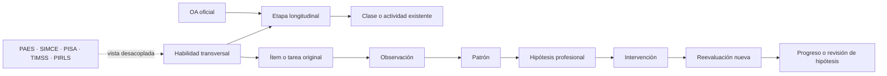

# Sistema longitudinal de competencias

Esta capa conecta aprendizajes ya desarrollados desde 1° básico hasta 4° medio. No reemplaza los OA, no crea un currículo paralelo y no convierte PAES, SIMCE, PISA, TIMSS o PIRLS en asignaturas.

[Informe de brechas previo](COMPETENCY_GAP_REPORT.md) · [Ciclo de evidencia](EVIDENCE_CYCLE.md) · [Marcos de evaluación](ASSESSMENT_FRAMEWORKS.md)

La portada del portal público incorpora el acceso a la vista longitudinal generada en `/competencias/`.

## Arquitectura



| Capa | Fuente | Responsabilidad |
|---|---|---|
| Currículo | `sources/mineduc-curriculum-snapshot.json` | Texto, código, nivel, eje y URL oficial del OA |
| Taxonomía | `competencies/taxonomy.v1.json` | Dominios y habilidades transversales del proyecto |
| Progresiones | `competencies/progressions.v1.json` | Etapas, indicadores, OA relacionados, patrones de error y reevaluación |
| Marcos | `competencies/frameworks.v1.json` | Fuente, versión, población, alcance, limitaciones y tipo de alineamiento |
| Banco | `assessments/item-bank.v1.json` | Tareas originales, criterios, rúbrica, distractores, autoría y estado de revisión |
| Evidencia | `evidence/evidence-cycle.schema.json` | Observación, hipótesis, intervención, reevaluación y decisión profesional |
| Motor | `scripts/competency_evidence.py` | Resumen descriptivo determinista, sin porcentajes ni habilidad latente |
| Validación | `scripts/validate_competency_system.py` | Integridad referencial, OA reales, licencias, límites y cierre del ciclo |

## Relación con el currículo existente

Los enlaces OA ↔ habilidad son `pedagogical_inference`: una interpretación documentada del proyecto. El OA conserva su redacción, secuencia y procedencia oficial. Una misma habilidad puede aparecer en Lenguaje, Matemática, Ciencias, Historia o Tecnología sin duplicarse.

Ejemplo:

```text
reading.causal-inference
  → LE01 OA 08: información explícita e implícita
  → LE04 OA 04: consecuencias de hechos o acciones
  → LE05 OA 06: inferencias e integración texto–gráfico
  → LE08 OA 09: evaluación de argumentos
  → FG-LELI-4M-OAC-03: evaluación crítica de textos
```

La progresión no obliga a dominar una habilidad por calendario. Los rangos muestran dónde existe evidencia curricular pertinente; el avance se decide con evidencia del estudiante y puede volver a prerrequisitos.

## Consultas que permite responder

### ¿Qué necesita dominar antes de una inferencia compleja?

1. Recuperar información explícita y ubicar una pista.
2. Distinguir lo dicho de lo inferido.
3. Relacionar causa, tiempo o referencia entre partes.
4. Integrar texto y representación visual.
5. Evaluar si la evidencia sostiene la conclusión.
6. Contrastar fuentes y declarar límites.

### ¿Qué aprendizaje anterior puede explicar una dificultad?

`error.causal-reversal` apunta a `reading.causal-inference`. El sistema propone revisar si el estudiante distingue orden temporal de causalidad y enlaza `LE04 OA 04` como intervención posible. Eso es una hipótesis: debe comprobarse con otra situación.

### ¿Qué clase existente puede usarse para intervenir?

El validador exige que cada `intervention_oa_code` exista en el snapshot. El portal resuelve ese OA a su primera clase publicada; el docente puede abrir la secuencia completa y escoger apoyo, práctica o profundización.

## Banco de tareas

El esquema admite:

- selección múltiple simple, múltiple y compleja;
- respuesta breve y desarrollada;
- resolución matemática y explicación;
- argumentación, comparación y síntesis;
- interpretación de tabla o gráfico;
- ensayo, proyecto y problema interdisciplinario.

Los distractores pueden enlazarse a un patrón de error, pero una selección aislada sigue siendo una observación. Las tareas cerradas deben incluir al menos una respuesta correcta; las abiertas deben publicar criterios y una rúbrica de cuatro niveles.

Los estados editoriales del banco son `draft`, `internal_review`, `expert_review`, `piloted`, `analyzed` y `validated`. Solo evidencia real permite avanzar de estado. “Validado” nunca se infiere por tener código, rúbrica o métricas.

## Interdisciplinariedad

Las relaciones son muchos-a-muchos. `item.data-school-water.01` activa lectura, datos, matemática y ciencias con un solo registro. No se crean cuatro copias de la misma competencia.

## Perfil de competencias

El perfil no usa porcentajes. Informa:

- habilidad observada;
- cantidad y diversidad de evidencias;
- patrón o hipótesis documentada;
- intervención realizada;
- resultado de la reevaluación;
- próxima decisión.

Un posible estado es “mejora observada en una situación nueva”. “Dominio descriptivo documentado” requiere decisión profesional explícita, intervención, tres evidencias exitosas, al menos dos reevaluaciones, tres ítems, dos contextos y dos formatos. Esos mínimos son una regla operativa transparente del proyecto, no un modelo psicométrico.

## Adaptación determinista

La arquitectura futura puede seleccionar la siguiente actividad con reglas simples:

| Evidencia actual | Decisión permitida |
|---|---|
| Tarea demasiado fácil y evidencia autónoma consistente | aumentar desafío o transferir |
| Dificultad adecuada | consolidar con otro contexto |
| Error repetido y relacionado | revisar prerrequisito e intervenir |
| Barrera de acceso | cambiar representación o vía de respuesta, conservar el OA |
| Evidencia insuficiente | ofrecer otra oportunidad; no inferir desconocimiento |

No se implementa IRT con una escala inventada. Si en el futuro existen datos de pilotaje suficientes, cualquier modelo psicométrico debe vivir en una capa separada, documentar población, supuestos, error, validez y posible DIF.

## IA opcional

El núcleo funciona sin IA. Una integración futura puede proponer variantes, explicar o ayudar a revisar una respuesta abierta, siempre que:

- registre modelo, versión, entrada y salida;
- distinga sugerencia de medición;
- permita revisión humana;
- tenga una alternativa determinista;
- nunca convierta una inferencia del modelo en puntaje psicométrico;
- proteja datos personales y no envíe evidencia identificable sin autorización.

## Versionado y extensibilidad

Los archivos declaran versión de esquema y versión de contenido. Agregar o retirar un framework no modifica OA, taxonomía ni progresiones. Un cambio incompatible crea una nueva versión; las referencias históricas se conservan.

## Comprobación

```bash
python scripts/validate_competency_system.py --json
python scripts/competency_evidence.py evidence/examples/reading-inference-cycle.json
python scripts/generate_competency_portal.py --check
```

La validación automática demuestra integridad estructural y reproducibilidad. No demuestra exactitud disciplinar, pertinencia cultural, accesibilidad real ni validez de interpretación: esas dimensiones requieren revisión humana y pilotaje registrados.
