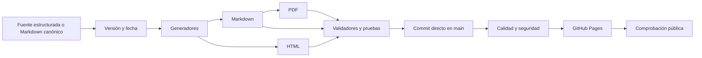

# Flujo versionado de contenido y despliegue

Este documento define cómo una nueva información pasa de fuente editable a contenido público sin perder trazabilidad. Es un contrato operativo: una modificación no está terminada cuando se edita un archivo, sino cuando todas sus representaciones derivadas se regeneran, validan, publican y comprueban.

[Metodología](../METHODOLOGY.md) · [Estándar de presentación](CONTENT_PRESENTATION_STANDARD.md) · [Contribuir](../CONTRIBUTING.md) · [Historial](../CHANGELOG.md)

## Fuente única y representaciones

| Información | Fuente editable | Salidas derivadas |
|---|---|---|
| Currículo y clases | `sources/mineduc-curriculum-snapshot.json` y reglas del generador | `curriculum/**/*.md`, `curriculum/catalog.json`, `docs/`, `site/classes/`, índices y sitemap |
| Competencias | `competencies/*.json`, `assessments/*.json`, `evidence/*.json` | `site/competencias/` y sus datos públicos |
| Documentación transversal | Markdown raíz y `docs/*.md` | `site/docs/*.html` y compilación PDF completa |
| Novedades | primera entrada fechada de `CHANGELOG.md` | `site/updates.json` y sección “Novedades” de la portada |
| Descargas | Markdown canónico seleccionado por `scripts/export_pdfs.py` | 49 archivos en `output/pdf/` y catálogo `docs/PDFS.md` |

Los artefactos derivados nunca son la fuente para una edición posterior. Una corrección se realiza en la fuente correspondiente y después se regenera.

## Niveles de versión

El proyecto distingue cuatro marcadores; ninguno sustituye a los demás:

| Nivel | Ejemplo | Cuándo cambia | Qué permite rastrear |
|---|---|---|---|
| Versión de esquema | `schema_version: 1` | cambia la forma obligatoria de un JSON | compatibilidad técnica |
| Versión de contenido | `taxonomy_version: 1.0.0`, `bank_version: 1.0.0` | cambia el significado o cobertura del conjunto | evolución pedagógica del dato |
| Fecha editorial | `updated_at: 2026-10-02` y encabezado del changelog | cambia información visible | corte documental publicado |
| Revisión Git | SHA del commit en `main` | cambia cualquier archivo versionado | reproducción exacta del repositorio |

Las versiones de contenido siguen `MAJOR.MINOR.PATCH`:

- **MAJOR:** se elimina o redefine un identificador o significado de manera incompatible;
- **MINOR:** se agregan habilidades, progresiones, tareas o relaciones compatibles;
- **PATCH:** se corrige redacción, procedencia o metadatos sin cambiar el significado esperado.

Los documentos narrativos no simulan una versión semántica propia. Su corte visible es la fecha y el título de la primera entrada del changelog; el commit identifica exactamente la revisión publicada.

## Flujo obligatorio para información nueva

1. **Identificar la fuente de verdad.** No comenzar por HTML, PDF ni un archivo derivado.
2. **Auditar lo existente.** Buscar OA, clases, habilidades, evaluaciones o documentación equivalente antes de crear otra estructura.
3. **Editar la fuente.** Conservar identificadores; si cambia un esquema o conjunto versionado, actualizar su versión y fecha según la tabla anterior.
4. **Registrar el cambio.** Añadir una nueva primera entrada en `CHANGELOG.md` con contenido, conexión, alcance y límites. No reescribir entradas históricas.
5. **Regenerar.** Ejecutar los generadores curricular, longitudinal y PDF que correspondan.
6. **Validar.** Ejecutar datos, licencias, competencias, presentación, tests, UTF-8 y compilación de Python.
7. **Comprobar reproducibilidad.** Una segunda generación no debe cambiar artefactos textuales. Los PDF se verifican semántica y estructuralmente, no por igualdad binaria entre sistemas operativos.
8. **Publicar en `main`.** El repositorio trabaja sin ramas paralelas para este flujo; el commit debe agrupar un cambio coherente y usar rutas explícitas al preparar archivos.
9. **Esperar los gates.** Calidad en Python 3.11–3.13, Seguridad y Pages deben terminar en verde.
10. **Comprobar el resultado público.** Verificar portada, novedades, documento HTML y descarga PDF cuando corresponda.

La portada carga `catalog.json` y `updates.json` con política `no-store`. El generador calcula además una versión determinista desde el script y ambos JSON; `index.html` la aplica a `app.js` y a las solicitudes de datos. Así, un despliegue correcto no queda oculto por el navegador ni por la caché del CDN.

## Gates de despliegue

| Gate | Falla cuando | Resultado esperado |
|---|---|---|
| Datos | faltan campos, OA o referencias | fuentes coherentes |
| Competencias | una habilidad, prerrequisito, patrón, OA o marco no existe | grafo referencial íntegro |
| Presentación | un Markdown pierde H1, rompe jerarquía o enlaza HTML interno; un HTML enlaza Markdown interno | superficies separadas y legibles |
| Licencias | falta procedencia, licencia o atribución | derechos explícitos |
| Pruebas | cambia un contrato verificable | comportamiento estable |
| Reproducibilidad | un generado comprometido no coincide con su fuente | repositorio sincronizado |
| PDF | inventario, fuentes, portada, metadatos, marcadores, enlaces o lectura son inválidos | 49 compilaciones utilizables |
| Pages | la construcción o validación previa falla | no se publica información incompleta |

## Retroceso y correcciones

Un despliegue defectuoso se corrige con un nuevo commit trazable en `main`; no se borra el historial ni se modifica una entrada antigua del changelog. Si la información publicada puede inducir una decisión pedagógica incorrecta, la nueva entrada debe identificar el alcance afectado y la corrección. Después se repite el flujo completo y se comprueba el sitio público.

## Definición de terminado

Un cambio visible está terminado solamente si:

- la fuente canónica y su versión están actualizadas;
- el README explica el cambio cuando afecta la arquitectura o el uso general;
- el changelog indica qué apareció y cómo se conecta;
- Markdown, HTML y PDF pertinentes provienen de la misma fuente;
- los enlaces respetan su representación;
- las validaciones locales y remotas están verdes;
- la información pública se verificó después del despliegue;
- los límites —revisión humana, pilotaje o validez— siguen visibles.
