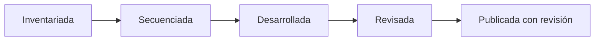

# Centro de documentación

Una puerta de entrada para comprender, usar y mejorar Trayectoria Escolar Chile sin confundir cobertura técnica con validación pedagógica.

[Abrir el portal](https://vladimiracunadev-create.github.io/chilean-school-learning-path/) · [Ver 1° básico](PRIMERO_BASICO.md) · [Consultar el estado editorial](../EDITORIAL_STATUS.md)

## Elige según lo que necesitas

| Si quieres… | Empieza aquí |
|---|---|
| Preparar una clase de 1° básico | [Mapa de contenidos de 1° básico](PRIMERO_BASICO.md) y [guía pedagógica](../TEACHING_GUIDE.md) |
| Saber qué observar y qué hacer después | [Evaluación formativa](EVALUACION_FORMATIVA.md) |
| Entender cómo se construyen las secuencias | [Metodología](../METHODOLOGY.md) |
| Revisar qué está completo y qué sigue pendiente | [Estado editorial](../EDITORIAL_STATUS.md) y [roadmap](../ROADMAP.md) |
| Encontrar una ruta para tu rol | [Rutas de uso](../LEARNING_PATHS.md) |
| Auditar la calidad de una clase | [Estándar de calidad](../QUALITY_STANDARD.md) |
| Ver la procedencia curricular | [Fuentes oficiales](../OFFICIAL_REFERENCES.md) y [textos y lecturas](../BOOKS_AND_READINGS.md) |
| Proponer una mejora | [Guía de contribución](../CONTRIBUTING.md) |

## Qué está listo hoy

- **Inventario y navegación:** 12.997 clases asociadas a 2.823 OA de 12 niveles.
- **Desarrollo pedagógico:** 1.034 clases de 1° básico y 22 clases piloto de otros niveles.
- **Revisión humana registrada:** 0 clases. El proyecto no usa “publicada” como sinónimo de “revisada”.
- **Portal:** búsqueda, filtros, fichas por OA, enlaces oficiales y páginas navegables.

## Cómo leer los estados

En el portal actual una clase puede estar publicada para consulta y seguir pendiente de revisión humana. El [estándar de calidad](../QUALITY_STANDARD.md) define la evidencia exigida en cada etapa.

## Alcance responsable

El repositorio reúne formación general, propuestas MINEDUC, asignaturas dependientes del contexto y opciones de 3°–4° medio. No representa una carga simultánea para un estudiante ni reemplaza los programas del establecimiento, las adecuaciones pertinentes o el criterio docente.

Los tiempos de 45 y 90 minutos son marcos adaptables. La evidencia real del curso manda sobre la dosificación inicial.
